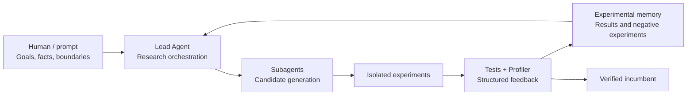

We recently asked Codex to work on a long-running performance optimization task based on Anthropic's [Original Performance Take-Home](https://github.com/anthropics/original_performance_takehome). Starting from the repository's baseline implementation, it iteratively searched for programs with lower cycle counts.

At first, progress came quickly. The model understood the simulator, restructured the program, explored candidates in parallel, and evaluated them against the tests. The cycle count fell from more than 100,000 to around 1,000.

Then the model plateaued.

It had not suddenly run out of ideas. What slowed the process was the analysis required after every idea: regenerating traces, opening timelines, determining whether idle cycles came from resource pressure or blocked dependencies, comparing what had actually changed between two candidates, and confirming that an optimization had not broken correctness.

Generating a new candidate could be quick. Comparing a complex trace with the previous version—and turning that comparison into a reliable next step—was becoming the dominant cost of iteration.

So we paused direct optimization and asked the agent to improve the trace-analysis and profiling infrastructure first. What followed reinforced one principle:

**When a model can already do demanding technical work, the highest-leverage human role is not to teach it how to work. It is to support the model: organize the facts, improve its instruments, preserve experimental memory, and maintain the boundaries of the research environment.**

That is the value of an agent harness.

## Why This Challenge Is a Good Test of an Agent Harness

This performance challenge simulates a VLIW/SIMD machine. The inputs, number of rounds, machine resources, and scoring method are fixed, and every program run produces a clear cycle count.

That makes it look ideal for an agent: there is a single objective, the feedback is measurable, and the model can repeatedly generate candidates and run tests. But once the score approaches a competitive level, a simple "modify, then benchmark" loop quickly stops being enough.

The same performance change can come from very different causes:

- The total number of operations genuinely decreased.
- The dependency chain became shorter.
- The scheduler happened to find a better arrangement.
- Temporary-storage lifetimes changed.
- The candidate passed a small set of tests but violated the full contract.

The repository's README also warns that some early low-scoring LLM submissions were invalid because the models had modified the tests. That added a non-negotiable requirement to the harness: scores had to come from frozen tests and independent verification, not from numbers reported by the model itself.

Before starting, we therefore wrote a fairly comprehensive optimization prompt. It did not tell the model which program representation or data layout to use. Instead, it fixed the research environment.

## The Prompt's Job Is Not to Provide the Answer

The prompt was 529 lines long, but length was not the point. What mattered was how much recurring uncertainty it removed from the task.

| Layer | What the prompt fixed | What it gave the agent |
| --- | --- | --- |
| Facts | Frozen tests, task semantics, workload, and authority hierarchy | Protection against optimizing the wrong target |
| Environment | Working directory, interpreter, reproduction commands, and file hashes | Comparable experiments |
| Collaboration | Roles for the lead agent, subagents, and sole integrator | Controlled parallel exploration |
| Memory | Experiment registry, candidate provenance, and negative results | Protection against repeating failed work after context compaction |
| Validation | Differential tests, static audits, the official checker, and honest handoff rules | Protection against mistaking accidental results for success |

Several rules capture the direction of the prompt especially well:

> Every delegated task must be concrete and bounded.

> Record meaningful negative experiments so later agents do not repeat them.

> No result becomes an incumbent solely from its own local test.

These rules did not perform the optimization for the model. They organized the research environment:

- Which files were authoritative.
- Which actions were strictly forbidden.
- What a subtask had to deliver.
- Which results were eligible to become the new incumbent.
- What evidence had to remain after a failure.
- How to report the boundary honestly when the target was not reached.

A good research prompt should not translate a human solution into more natural language. It should function as a research contract: remove irrelevant uncertainty and reserve the genuinely creative, judgment-intensive work for the model.

## Multi-Agent Work Is About Research Diversity, Not Concurrent Editing

We used multiple subagents for this task, but they did not modify the final implementation simultaneously.

The lead agent was the sole integrator. It maintained the incumbent, assigned research directions, reviewed candidates, and updated the experiment records. Subagents were read-only by default, or wrote their results into isolated candidate files.

Each task needed a clear boundary. For example:

- Determine whether a representation could reduce the operation count.
- Audit a candidate's dependencies and memory safety.
- Search a scheduling-parameter space and return the complete configuration.
- Produce a counterexample, lower bound, or concrete negative result.

The goal was not merely to "run more models at once." It was to maintain a research portfolio.

If every agent performs local tuning around the current design, more concurrency only reproduces the same line of thought faster. Giving different agents some independence, then letting the lead agent validate and integrate their findings, creates a better chance of discovering genuinely different approaches.

The experiment registry served as external memory. Every serious candidate recorded its source, hypothesis, result, validation method, and failure reason. Even after context compaction, later agents could recover the research state from the workspace instead of depending on what the model happened to remember.

## The Real Bottleneck Appeared Around 1,000 Cycles

During the first half of the run, the model kept making progress through tests, static counts, and manual trace analysis. Once the score reached roughly 1,000 cycles, that loop began to slow noticeably.

The problem was not the latency of the model call itself. A complete iteration now involved an increasingly heavy feedback workload:

1. Construct and run a candidate.
2. Generate a new execution trace.
3. Search for bottlenecks in the Perfetto timeline.
4. Determine why particular engines were not full.
5. Decide whether the cause was resources, dependencies, scheduling policy, or temporary storage.
6. Compare the candidate with the previous version field by field.
7. Rerun the full correctness and validity checks.

The original repository could already generate Chrome Trace output, but the workflow was better suited to a human opening the UI and inspecting it. The agent could see what was issued in a given cycle, but it could not directly obtain an explanation for why more operations were not ready to run.

Worse, the traces and analysis reports themselves consumed large amounts of context. On every iteration, the model had to reread, filter, and interpret similar information. Even when it could do that work successfully, the feedback latency reduced the throughput of the research process.

At that point, asking the model to "think harder" would not solve the underlying problem. What we lacked was not a more clever optimization hint, but a shorter and more structured feedback loop.

So we asked the agent to pause optimization and improve the tracing infrastructure first.

## Letting the Agent Improve Its Own Instruments

First, we set up Perfetto and Trace Processor locally. The agent could query and summarize traces from the command line without relying on a browser and the hosted Perfetto UI for interactive inspection. When a visual timeline was useful, we could still use a local UI.

The second step was to build a scheduler-aware profiler. The scheduling pipeline exported metadata such as operations, dependencies, ready times, and issue times, while the profiler derived information about temporary-storage lifetimes.

The third step was to turn the entire workflow into an automated pipeline. The pipeline could now produce the following for every candidate:

- Correctness and frozen-test results.
- Resource usage by engine.
- Evidence about whether idle cycles were more likely caused by dependencies or scheduling policy.
- Peak simultaneously live temporary data.
- A precise comparison with the previous version.
- Fingerprints for the exact program and trace behind those conclusions.

The most important change was that a visualization tool designed primarily for humans became a feedback interface that the agent could consume reliably.

The profiler did not invent new optimization structures. The model still had to understand the program, formulate hypotheses, and implement candidates.

What changed was the cost of diagnosis. The model could now begin with a structured conclusion and inspect the underlying evidence only where necessary. A failed candidate no longer left behind little more than "the score got worse." It recorded why the score got worse and whether the route was worth reopening.

Infrastructure did not replace the model's reasoning. It removed mechanical friction from the loop.

## From a Plateau to the Public Top Five

With the new profiler in place, trace diagnosis became more structured. The model could distinguish more quickly between questions such as:

- Should we keep improving the schedule, or must we reduce the amount of work?
- Why did a shorter-looking critical path fail to improve the final score?
- Is temporary storage truly exhausted, or is lifetime management too conservative?
- Did an optimization merely move the bottleneck, or did it improve the system overall?

The cycle count continued to fall, eventually yielding a strong result backed by a complete local verification trail.

As of July 12, 2026, the author's account, `@stool233`, ranked fifth on the public [VLIW Kernel Challenge](https://vliw-challenge.fly.dev/) "Without Indices" leaderboard at 951 cycles. The leader in that category, `@wouterkool`, had 892 cycles.

*Public "Without Indices" leaderboard as of July 12, 2026. `@stool233` is the author's own account.*

We treated the leading public score of 892 cycles as an important reference point. Our result still fell short of it and should not be described as globally optimal. But reaching the public top five showed that this research loop could produce more than a large archive of experiments—it could also produce a competitive result.

The more important result was not the exact cycle reduction, but the increase in iteration throughput.

The model did not suddenly become more intelligent because we installed a profiler. The agent harness changed: feedback became faster, candidates became easier to compare, negative results became reusable, and long-running work became less likely to lose direction after context compaction.

## Controlling Interference from External Answers

Our boundary was not a blanket ban on network access. We explicitly allowed network access for the approved Perfetto installation, but not for searching benchmark solutions.

Installing Perfetto was part of building the infrastructure. Public scores could serve as target references. Public forks, solution-specific hints, and ready-made implementations, however, would directly reshape the model's search path and make the provenance of the result difficult to assess.

Although the initial prompt already stated this rule, the agent still deviated from it once and attempted to search for public clues and GitHub forks. We stopped the search and instructed it not to continue consulting forks or use information from that search. From that point on, every change accepted into the final result required a reproducible verification trail through the local repository, frozen simulator, profiler, and solver.

This illustrates an important point: a rule written in a prompt is not the same thing as an enforced boundary.

During an experiment, a human can intervene and correct the course. In a production agent harness, stronger controls should also include tool permissions, network egress restrictions, audit logs, and runtime policies. Otherwise, a model can drift away from even a clearly written instruction during a long-running task.

The integrity of the tests cannot depend on prompt compliance alone, either. The final version must recheck the frozen-file hashes, confirm that `tests/` has not changed, and run both the official checker and independent audits in a clean environment.

Safety, validity, and reproducibility are not supplementary checks performed after optimization. They are part of the agent harness feedback loop itself.

## Humans Support the Model; the Model Does the Technical Work

In this experiment, the division of labor looked roughly like this:

| Human / harness | Model / agent |
| --- | --- |
| Fix the facts, target, and validity boundaries | Understand the task and propose program structures |
| Identify bottlenecks in the feedback loop | Build the tracing and profiling infrastructure |
| Maintain the boundary around external answers and permissions | Continue exploring from local feedback |
| Design subagent isolation and a sole-integrator policy | Search, validate, and audit candidates in parallel |
| Require experiment records and honest handoffs | Implement candidates and preserve both successes and negative results |
| Decide when to improve the instruments instead of demanding another result | Perform the actual performance reasoning and engineering |

This does not mean humans can ignore the technical problem, or that models can work without supervision.

Human intervention has more leverage when it asks whether the model currently lacks facts, tools, memory, feedback, or boundaries, rather than prescribing the next concrete optimization.

Models are already capable of doing a large amount of genuinely difficult technical work. The agent harness exists to keep those capabilities focused on the right problem and to ensure that every action produces feedback that is verifiable and cumulative.

## Conclusion: An Agent Harness Is the Model's Working Environment

Agent performance is often attributed to model capability or prompting technique. In long-running, open-ended engineering tasks, however, the upper bound is often determined by the entire working environment.

The same model, in an environment where it must repeatedly reread raw traces, will spend much of its time recovering state and interpreting feedback. In an environment with an automated profiler, experimental memory, candidate isolation, and a validation ladder, it can devote more reasoning to genuine structural innovation.

Supporting the model does not mean doing the work on its behalf.

It means organizing the problem into stable facts, turning tools into interfaces the model can consume, preserving failures as assets for the next research round, and maintaining clear boundaries when the model drifts.

As models become better at working, the most valuable human role is not to keep telling them what to do next. It is to build the laboratory, calibrate the instruments, and let the model apply its capabilities where real judgment is required.

## References

- [Anthropic: Original Performance Take-Home](https://github.com/anthropics/original_performance_takehome)
- [VLIW Kernel Challenge Public Leaderboard](https://vliw-challenge.fly.dev/)
- [Perfetto v57.2 Release](https://github.com/google/perfetto/releases/tag/v57.2)
