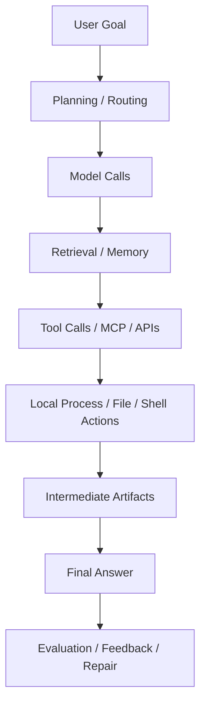
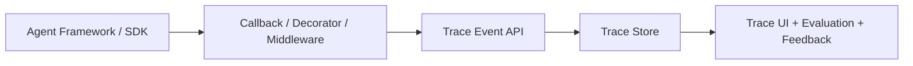
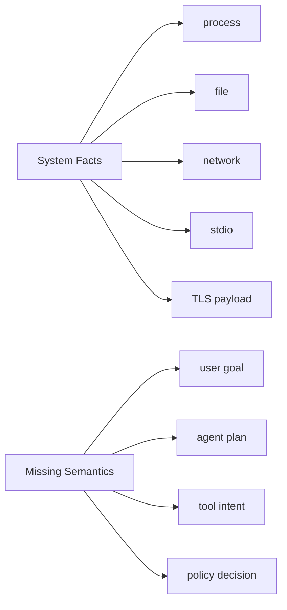
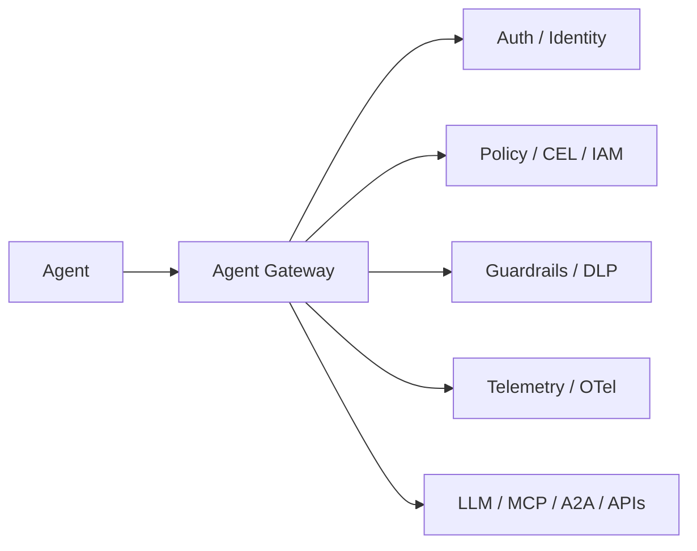
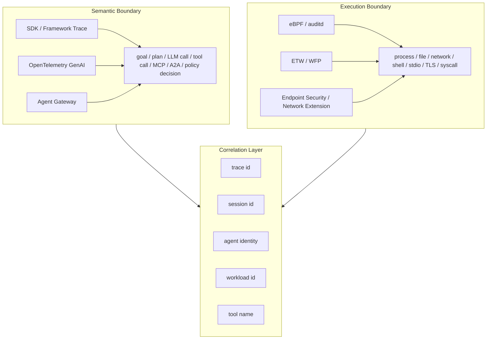
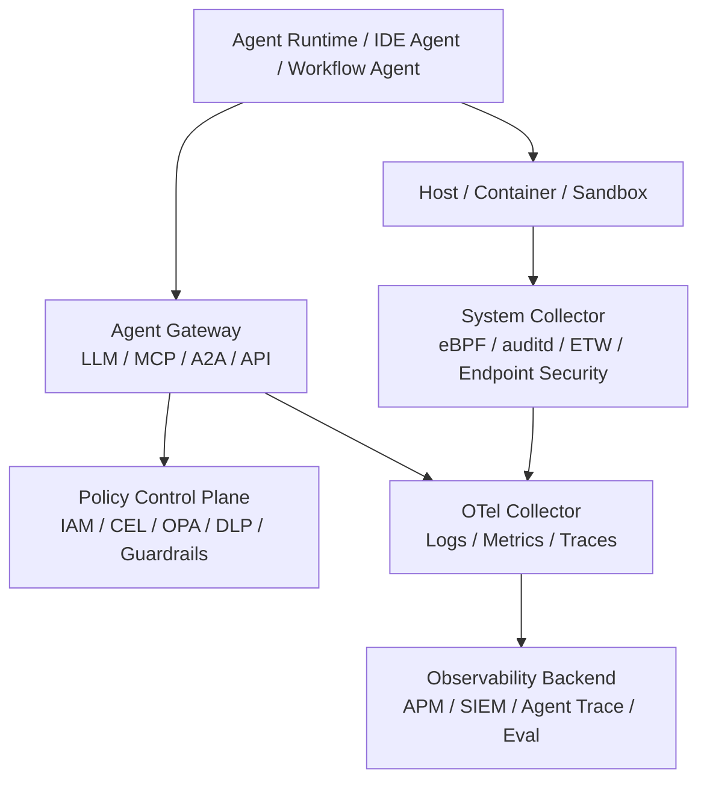

While researching observability for AI agents, we started with a simple question: if we already have LLM tracing, prompt logging, and evaluation platforms, why do we need a separate discussion about agent observability?

If an agent is only a chat application wrapped around an LLM API, the answer is not complicated. A request comes in, the model returns a response, and we record the prompt, completion, model, token usage, latency, cost, errors, and perhaps user feedback. That covers most of the important path.

But agents are no longer just applications that talk. They plan tasks, call tools, access databases, read and write files, run shell commands, launch browsers, connect to MCP servers, and collaborate with other agents. Their output is not only text. It is a chain of actions that can affect the outside world.

At that point, the object of observability changes. We no longer only care about what the model said. We need to know:

- Why did the agent decide to act this way?
- Which tools did it call?
- Which files, processes, and network endpoints did it actually touch?
- Were those actions authorized?
- If the result was wrong, can we reconstruct the full causal chain?

The core argument of this article is: **the future of agent observability is not a prettier LLM trace UI. It is the ability to connect an agent's semantic intent with its real system-level side effects, and to turn critical action paths into observable, evaluable, and governable control points.**

In other words, agent observability is moving toward a dual-boundary model: the semantic boundary explains what the agent believes it is doing, the system-fact boundary verifies what the agent actually did, and the agent gateway moves critical actions into a path where they can be authorized, audited, and blocked before they happen.

## 1. Why LLM Observability Is Not Agent Observability

The basic unit of LLM observability is a model call.

It usually tracks prompt, completion, model, provider, tokens, latency, cost, errors, caching, and retries. These signals are useful because they help us debug model quality, control cost, analyze latency, and investigate failures.

But the basic unit of agent observability is not a model call. It is a task trajectory.



In that trajectory, model calls are only one part. The harder problems often happen after the model response: the agent chooses a tool, passes arguments, interprets tool results, decides whether to continue, and turns a series of actions into something that looks like a coherent task.

That is why agent risk is not limited to "saying the wrong thing." It is often about "doing the wrong thing."

If a customer support agent gives a wrong answer, that is a quality issue. If it incorrectly calls a refund API, that is a business risk. If a coding agent gives a bad explanation, it may mislead a developer. If it runs the wrong command in a workspace, deletes files, or leaks source code, that is a system risk. If an internal enterprise agent exposes a database table as a tool that the model should never have seen, that is not just a prompt-engineering problem. It is a permission-boundary problem.

Agent observability therefore needs to answer at least six kinds of questions.

First, semantics: what goal, plan, and steps did the agent believe it was executing?

Second, facts: what did the agent actually do to external systems and the host environment?

Third, cost: how much token usage, time, and money did a task, workflow, agent, or tool consume?

Fourth, quality: was the result correct, did it satisfy the business goal, and can it be evaluated and reproduced?

Fifth, safety: did the agent overstep permissions, leak data, or access tools and files it should not have accessed?

Sixth, reproducibility: when something fails, can we reconstruct the full context, tool outputs, and environmental impact?

If we model only around LLM requests, we can answer only part of this. We can know what the model saw and generated, but not what the agent actually did afterwards. That is the line between LLM observability and agent observability.

## 2. The Mainstream Route: Application-Level Tracing and Evaluation

The most mature products in agent observability today are application-level tracing and evaluation platforms.

LangSmith, Langfuse, Arize Phoenix / OpenInference, W&B Weave, Braintrust, Comet Opik, and AgentOps all broadly fit this category. Their shared approach is to instrument application code, agent frameworks, or SDKs with callbacks, decorators, or middleware. They record LLM calls, chains, tool calls, retrievers, agent steps, datasets, evaluations, and feedback inside an agent run, then expose trace UIs, dashboards, experiments, annotation workflows, and evaluation pipelines.



The strength of this route is clear: it understands agent semantics better than any other layer.

Application-level instrumentation knows which LangGraph node was executed, why a function was treated as a tool, which documents a retriever returned, and which dataset an evaluation used. For development, debugging, prompt iteration, offline evaluation, and online feedback, these platforms are very valuable.

But they also have a natural boundary: they capture what the application reports, not what was independently observed at the system boundary.

This does not mean SDK traces are unreliable. A better way to say it is: they are semantically rich, but their coverage boundary is incomplete. Once an action happens outside the framework, it may disappear from the trace.

For example:

- The agent starts a subprocess through the shell.
- An MCP server is connected over stdio and performs complex local interactions.
- A closed-source CLI agent runs locally without SDK instrumentation.
- A tool internally accesses the file system, the network, or a database.
- The agent bypasses the framework and directly calls another SDK or local command.

These behaviors can be critical for security and incident reconstruction, but they may not appear in an application-level trace.

So application-level tracing is the semantically strongest layer, but it is not the most complete factual boundary. It tells us what the agent claims it did. It does not always prove what actually happened in the host environment.

## 3. OpenTelemetry GenAI Is Becoming the Common Language

If application-level platforms solve the problem of understanding agent semantics, OpenTelemetry GenAI semantic conventions solve a different problem: can those semantics enter the broader observability ecosystem?

This matters. Enterprises already have logs, metrics, traces, APM, SIEM, alerting, SLOs, and incident workflows. If every LLM or agent platform maintains its own private trace schema, agent observability becomes another silo. OpenTelemetry's value is to provide a common data model across tools, languages, clouds, and backends.

Recent progress in OpenTelemetry GenAI shows that it is no longer only about recording a chat completion. It is expanding across model spans, agent spans, events, metrics, tokens, cost, streaming, retrieval, tool execution, and MCP. In the future, the root of an agent trace should not always be a model call. It is more likely to be an `invoke_agent`, a workflow, or a task.

That means we need to move from:

```text
chat.completion
  -> prompt
  -> response
```

to:

```text
invoke_agent / invoke_workflow
  -> planning
  -> model calls
  -> retrieval
  -> tool execution
  -> MCP calls
  -> evaluation
  -> exception / feedback
```

This shift is important. For agents, model calls are child steps. The task is the root object. Cost, latency, quality, and safety should ultimately be attributable to a task, workflow, agent, or business goal.

However, OpenTelemetry GenAI is still evolving quickly. Semantics for task/workflow naming, planning versus execution, memory, artifacts, authorization, trust, and A2A are not fully stable yet. It should not be presented as a finished standard. It is better understood as a common language that is still being formed.

There is also an easy-to-miss issue: content and traces must be decoupled.

In production, prompt, response, and tool results should not be written into traces by default. They may contain source code, secrets, customer data, personal information, or internal documents. A more reasonable design is:

- Keep low-cardinality, aggregate-friendly, sample-friendly attributes in traces.
- Do not collect sensitive content by default, or collect it only after redaction.
- Store large payloads in controlled object storage and put only references on spans.
- Represent evaluations, feedback, exceptions, and policy decisions as events or logs.

So OpenTelemetry GenAI is not a replacement for LangSmith, Langfuse, Phoenix, or system-level collectors. It is a semantic interoperability layer. It gives behavior data from different sources a chance to become one queryable, correlatable, and governable trace.

## 4. The Underestimated Layer: Non-Intrusive System-Level Observability

If application-level traces are strong in semantics, system-level observability is strong in facts.

AgentSight is a representative example of this direction. It does not require developers to instrument agent code. Instead, it treats the agent as a black box and observes what it actually does at the system boundary. On Linux, eBPF can be used to capture TLS plaintext, process events, file events, stdio, and resource metrics, then a collector can parse, filter, and visualize the results.

The value of this approach is that it does not depend on the agent honestly reporting its own behavior. If an action crosses a system boundary, there is a chance to observe it.

For example:

- Which process initiated a model API request.
- What a local MCP server exchanged over stdio.
- Which subprocesses the agent started.
- Which files it read or wrote.
- Which network connections it established.
- Which system-level side effects followed a tool call.

This is the kind of information that many agent incident reviews actually need. When something goes wrong, we cannot look only at what the model said. We also need to know what the agent did to the system.

But system-level observability is not a complete answer either. It sees facts such as processes, files, network connections, stdio, TLS payloads, and syscalls. It does not naturally know which user goal, agent step, tool call, or policy decision those facts correspond to.

In other words, system-level observability can answer "what happened," but not always "why it happened."



Cross-platform support also introduces additional complexity. eBPF is a natural entry point on Linux. macOS requires Endpoint Security, Network Extension, system proxies, or similar mechanisms. Windows may require ETW, WFP, drivers, or enterprise security integrations. The events available, permission cost, and deployment model differ across platforms.

So this route should not be understood as "use eBPF everywhere." The better abstraction is to keep a unified event model while allowing platform-specific collection mechanisms. Linux may use eBPF, Windows may use ETW/WFP, macOS may use Endpoint Security or Network Extension, and cross-platform network behavior may be supplemented by proxies.

System-level observability solves factual confidence. Used alone, it lacks semantic interpretation. This leads to the most important point of this article: agent observability should not choose between application-level traces and system-level traces. It needs to correlate them.

## 5. Agent Gateway: Observability Moves Toward Governance

Beyond application-level tracing and system-level observation, another layer is becoming increasingly important: the agent gateway.

Traditional API gateways govern user-to-service HTTP/RPC traffic. AI gateways mainly govern application-to-model calls, such as provider routing, rate limits, budget controls, fallback, and prompt/response guardrails. Agent gateways have a broader boundary. They try to govern agent-to-LLM, agent-to-tool/MCP, agent-to-agent/A2A, and agent-to-external-API traffic.

That is why an agent gateway should not be understood as just another LLM proxy. Its real value is to converge critical agent communication paths into a data plane that can authorize, audit, observe, and block actions.

Google Cloud Gemini Enterprise Agent Platform Agent Gateway represents the managed cloud route. It places Agent Gateway in the Govern layer and connects it with Agent Identity, Agent Registry, IAP/IAM, Model Armor, Semantic Governance Policies, Service Extensions, Cloud Logging, Cloud Trace, and Agent Observability. Its focus is not merely traffic forwarding. It makes governance decisions for paths such as Agent-to-Anywhere and Client-to-Agent based on agent identity, registry metadata, policy, and content safety.

The open-source `agentgateway/agentgateway` project represents a more portable route. It is built around agentic protocols such as MCP and A2A while also covering LLM Gateway, MCP Gateway, A2A Gateway, Inference Routing, Guardrails, and Security & Observability. It supports JWT, API keys, OAuth, CEL policies, OTel metrics/logs/tracing, prompt enrichment, regex guards, OpenAI moderation, AWS Bedrock Guardrails, Google Model Armor, custom webhooks, and more.

MCP and A2A are especially important here.

MCP gives tool calls a standardized interface: `tools/list`, `tools/call`, tool names, arguments, and results. For a gateway, this means it does not merely see an HTTP POST. It can understand that a user is listing tools, that an agent is calling a particular tool, and what arguments were passed. More importantly, the gateway can filter unauthorized tools during discovery instead of waiting until a tool call fails.

A2A turns agent-to-agent communication into a new kind of east-west traffic. In the open-source agentgateway A2A example, the gateway rewrites the agent card URL so future requests continue to go through the gateway instead of bypassing it after discovery. This resembles the role of service mesh in the microservices era, but the object is now the agent.

The key value of an agent gateway can be summarized in one phrase: it provides pre-action observability.

Many observability systems explain what happened after the fact. A gateway can authorize, filter, reject, redact, rewrite, route, or delegate policy decisions before an action happens.



But the boundary of a gateway must be stated clearly. It can govern only traffic that passes through it.

If an agent directly executes shell commands, reads and writes local files, starts subprocesses, accesses a local database, or bypasses the proxy by directly calling an SDK, the gateway will not see it. It is not non-intrusive system-level observability. It does not replace sandboxing, egress policy, eBPF, ETW, or Endpoint Security.

So agent gateways and system-level observability are complements. The gateway governs the agentic protocol boundary. System-level observation covers the runtime and OS boundary.

## 6. The Dual-Boundary Model: Connecting Semantics and Facts Into One Causal Chain

We can now draw the full structure of agent observability.



This is the dual-boundary model.

The first boundary is the semantic boundary. It explains what the agent believed it was doing: the user goal, the plan, the model call, the selected tool, the MCP or A2A interaction, and the policy decision made by the gateway.

The second boundary is the execution boundary. It verifies what the agent actually did: which process it started, which files it read and wrote, which network connections it opened, what it exchanged over stdio, what appeared in TLS plaintext, and whether it invoked shell or browser automation.

Between them we need a correlation layer: trace IDs, session IDs, agent identities, workload IDs, tool names, connection metadata, process trees, and container or pod information. Without this layer, semantics and facts remain two disconnected piles of data.

With only semantic traces, we know what the agent says it did, but we cannot verify system side effects.

With only system traces, we know what the process actually did, but we do not know which user goal, tool call, or policy decision caused it.

Once the two are connected, production teams can answer the questions they actually care about:

- Who caused the agent to perform this action?
- What was the agent's goal and plan at the time?
- Which tool did it call, and with what arguments?
- Was the tool call authorized?
- What actually happened at the system level after the call?
- Did the agent access files or network endpoints it should not have accessed?
- Can the failure be reproduced and fixed?

From this perspective, the key to agent observability is not choosing SDK tracing or eBPF. It is connecting both into one causal chain.

## 7. Market Landscape: The Problem Is Not a Lack of Trace UIs

Using this framework, the market becomes easier to read. Current players are approaching the same problem from different entry points.

| Route | Examples | Strength | Main Gap |
| --- | --- | --- | --- |
| LLM/agent tracing + eval | LangSmith, Langfuse, Phoenix, Braintrust | Strong semantics, good for development and evaluation | Depends on SDK or framework integration |
| AI gateway/proxy | Helicone, Portkey, LiteLLM | Strong model traffic governance | Limited visibility into tools and local side effects |
| OTel-native instrumentation | OpenLLMetry, OpenLIT, OpenInference | Strong interoperability and enterprise observability fit | Still depends on instrumentation |
| Traditional APM | Datadog, New Relic, Grafana | Mature infrastructure | Weak agent semantics |
| Non-intrusive system-level observability | AgentSight, eBPF, ETW, Endpoint Security | High factual confidence | Weak semantic interpretation |
| Agent Gateway | Google Cloud Agent Gateway, agentgateway | Strong governance | Requires traffic to pass through the gateway |

This table is not a ranking. It shows that agent observability is not yet a cleanly bounded standalone market. Different players are extending into agent scenarios from different starting points.

The most mature products are still application-level tracing and evaluation platforms. That makes sense. Developers need debugging, prompt and tool-call visibility, experiments, and feedback loops. Those needs are clear and productizable.

But as we move toward production and enterprise environments, the question shifts from "can we see this agent run?" to "can we trust this agent?" That shift exposes several gaps.

The first gap is a converter from system facts to OTel GenAI semantics. System events can be captured, but turning them into queryable, correlatable, governable agent traces still lacks common practice.

The second gap is task/workflow-level attribution for cost, risk, and quality. Enterprises will not only ask how much a single model request cost. They will ask the total cost, failure rate, security risk, and business value of a class of agent tasks.

The third gap is observability for local agent CLIs and developer workstations. Tools like Claude Code, Cursor, and Gemini CLI increasingly perform real actions on developer machines. These environments are neither pure cloud services nor traditional backend applications.

The fourth gap is the loop between observability and policy enforcement. Recording the problem is not enough. Enterprises need dry-run, audit-only, blocking, approval, replay, policy testing, and continuous improvement.

So the market is not short of trace UIs. It is short of an agent observability architecture that unifies semantics, facts, governance, and evaluation.

## 8. Enterprise Adoption: Start With Identity, Critical Paths, and Critical Side Effects

For enterprise adoption, this should not begin with collecting everything.

Collecting everything is tempting because it feels complete. But in agent systems, full prompts, responses, tool results, file contents, and network plaintext may all contain sensitive data. The more you collect, the more compliance, cost, and security pressure you create.

A more realistic path is to first make critical identities, critical paths, and critical side effects correlatable.

A reasonable architecture looks like this:



The adoption path can be broken into five steps.

First, standardize trace IDs, session IDs, and agent identities.

Without stable identity and correlation keys, all logs, traces, and system events become isolated data. Agent identity does not need to be perfect on day one, but the system should at least answer: which agent was this, on behalf of which user or service account, and in which runtime environment?

Second, route LLM, MCP, A2A, and critical API traffic through a gateway or unified proxy.

The purpose is not to add another forwarding layer. It is to bring high-risk communication paths into a data plane that can authorize, audit, observe, and block actions. MCP tool calls and agent-to-agent communication should be especially hard to bypass.

Third, add system-level collectors for high-risk execution environments.

Not every agent needs eBPF or Endpoint Security on day one. But agents that can execute code, access enterprise data, read and write files, or run shell commands need system-level fact collection. Otherwise, after an incident, application-level traces alone may not prove what actually happened.

Fourth, use the OTel Collector as the telemetry aggregation layer.

Data from different sources can enter a unified pipeline and then be routed to APM, SIEM, agent observability backends, and evaluation pipelines. This avoids locking the architecture into one product and makes sampling, redaction, filtering, and routing easier.

Fifth, build the loop across evaluation, feedback, policy, and alerting.

The end state of observability should not be a dashboard. A failed trace should become an evaluation case. A high-risk action should trigger policy improvement. A false positive should enter policy tests. User feedback should improve future agent behavior.

The specific tools matter less than three principles:

- Semantic data and system facts must be correlatable.
- High-risk actions should go through governable paths whenever possible.
- Content collection should be minimized, while policy and audit should exist by default.

## 9. Questions We Still Do Not Fully Have Answers To

First, OpenTelemetry GenAI agent semantics will continue to change.

That is not a bad thing. It means the community is still converging quickly. But enterprise implementations should avoid binding internal schemas too tightly to a field model that is not yet stable. A safer approach is to keep an adapter layer so internal event models can map to OTel and evolve with the spec.

Second, the tension between content collection and compliance will grow.

The most valuable parts of an agent trace are often the most sensitive: prompts, tool arguments, file contents, code snippets, and user data. Production systems should default to redaction, short retention, least privilege, and explicit opt-in for full payload capture.

Third, agent gateway coverage depends on preventing bypass.

Deploying a gateway is not enough. If agents can freely change base URLs, access the internet directly, or call local tools outside the proxy, the gateway becomes a component that sees only part of the traffic. In real deployments, runtime controls, sandboxing, egress policy, and organizational network policy must work together so critical paths cannot be easily bypassed.

Fourth, system-level collection has permission and adversarial costs.

Linux eBPF, macOS Endpoint Security, and Windows ETW/WFP each have deployment costs. More importantly, adversarial agents may change channels, encrypt payloads, or use external proxies. System-level observation cannot carry the whole security burden alone. It must work with sandboxing, gateways, and policy.

Fifth, the boundary between evaluation and observability will blur.

Historically, observability was closer to monitoring, while evaluation was closer to offline testing. In agent systems, an online failure trace naturally becomes an evaluation case; user feedback defines new quality signals; and a policy block becomes a safety evaluation sample. Over time, these layers are likely to merge into a continuous improvement loop.

## Conclusion: The End Goal of Agent Observability Is Trust, Not Dashboards

If the question is "do agents need observability?", the answer is obviously yes.

The more important question is: what are we trying to build with observability?

If the goal is only to see prompts and responses, existing LLM observability already solves a lot. If the goal is to debug agent workflows, application-level tracing and evaluation platforms are already quite mature. But once agents start acting on behalf of people, calling tools, accessing data, modifying files, starting processes, and collaborating with other agents, observability can no longer mean only "seeing a call."

It must help us build trust.

That trust does not come from the model looking smart. It comes from a verifiable chain: what goal the user gave, how the agent understood and planned, which models and tools it called, which actions were authorized or blocked, what actually happened at the system level, whether the result can be evaluated, and whether failures can be reconstructed and improved.

That is why the next layer of agent observability connects semantic traces, system facts, agent gateways, OpenTelemetry, evaluation, and policy.

Application-level traces help us understand the agent's intent. System-level observation verifies real side effects. Agent gateways move high-risk actions into governable paths before they happen. OpenTelemetry gives these data streams a chance to enter the enterprise observability stack. Evaluation and feedback ensure that problems are not only seen, but continuously improved.

When agents start acting on behalf of humans, the end goal of observability is no longer a dashboard. It is a complete chain from intent to side effects, from recording to governance, and from debugging to trust.

## References

- OpenTelemetry GenAI semantic conventions: https://opentelemetry.io/docs/specs/semconv/gen-ai/
- OpenTelemetry GenAI attributes registry: https://opentelemetry.io/docs/specs/semconv/registry/attributes/gen-ai/
- LangSmith Observability: https://docs.smith.langchain.com/observability
- Langfuse: https://langfuse.com/
- Arize Phoenix / OpenInference: https://phoenix.arize.com/ and https://github.com/Arize-ai/openinference
- W&B Weave: https://weave-docs.wandb.ai/
- Braintrust: https://www.braintrust.dev/
- Comet Opik: https://www.comet.com/site/products/opik/
- AgentOps: https://www.agentops.ai/
- Helicone: https://www.helicone.ai/
- Portkey: https://portkey.ai/
- LiteLLM Proxy: https://docs.litellm.ai/docs/simple_proxy
- OpenLLMetry / Traceloop: https://github.com/traceloop/openllmetry
- OpenLIT: https://github.com/openlit/openlit
- AgentSight: https://github.com/eunomia-bpf/agentsight
- AgentSight issue #17: https://github.com/eunomia-bpf/agentsight/issues/17
- Google Cloud Agent Gateway overview: https://docs.cloud.google.com/gemini-enterprise-agent-platform/govern/gateways/agent-gateway-overview
- Google Cloud IAP for agents overview: https://docs.cloud.google.com/iap/docs/agent-overview
- agentgateway/agentgateway: https://github.com/agentgateway/agentgateway
- MCP: https://modelcontextprotocol.io/
- A2A: https://developers.googleblog.com/en/a2a-a-new-era-of-agent-interoperability/
