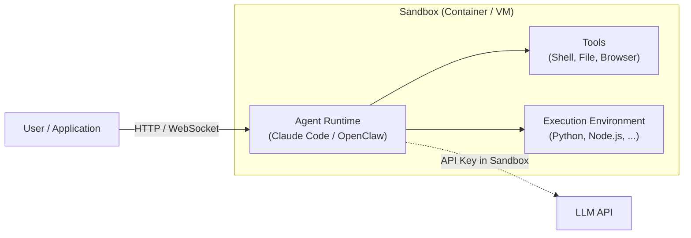
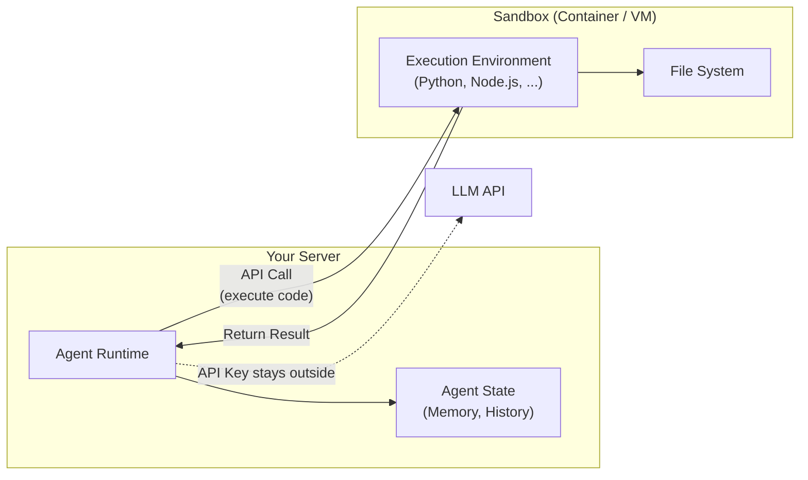
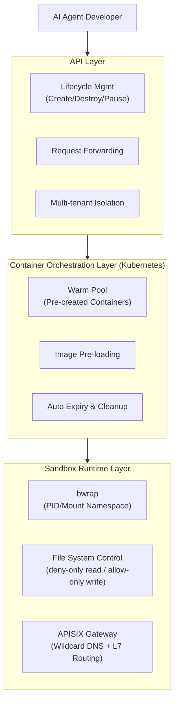

## 1. Introduction

We operate an internal platform for AI Agent developers called AI Agent Studio. As more and more business teams began building Agents that need to execute code and operate on file systems, we added Agent Sandbox capabilities to the platform, providing isolated execution environments for Agents. Based on this capability, multiple scenarios have been deployed, including cloud-based Claude Code, SRE Agent, cloud-based OpenClaw, and code analysis Agents.

Why has Sandbox become a critical component in Agent infrastructure? Today's AI Agents are no longer just chatbots. They need their own "computer" — to run code, install dependencies, operate on file systems, and even start HTTP services. But Agent behavior is not entirely controllable: prompt injection can cause it to execute unexpected commands, and model errors can lead to `rm -rf` disasters. A sandbox provides an isolation boundary, allowing Agents to operate freely within a controlled environment while protecting the host system's security.

But the value of sandboxes goes beyond security. [Cursor's data](https://cursor.com/cn/blog/agent-sandboxing) shows that enabling sandboxing reduced Agent stalls by 40%. The reason: without a sandbox, users need to approve each Agent command one by one. The approval process itself is both time-consuming and prone to becoming perfunctory (approval fatigue). A sandbox, by defining security boundaries, automatically permits operations within those boundaries, and the security guarantees actually unlock efficiency. In other words, **a sandbox is not just a security component that prevents Agents from causing damage — it's an efficiency infrastructure that enables Agents to work more freely**.

This article systematically covers the full landscape of Agent Sandbox — from architecture patterns, isolation technologies, and industry solutions to enterprise practice — and shares our experience and insights from deploying it in an enterprise setting.

## 2. Two Architecture Patterns

LangChain founder Harrison Chase [categorized the connection patterns](https://x.com/hwchase17/status/2021261552222158955) between Agents and sandboxes into two models. This framework has been widely referenced in subsequent discussions of various solutions.

### Pattern 1: Agent Runs Inside the Sandbox

In this pattern, the Agent and execution environment are tightly coupled — you package the Agent framework into an image and run it inside the sandbox, with external communication via HTTP or WebSocket. It's like running Claude Code on a remote server, with users connecting through a web interface.

**Advantages**: Close to the local development experience. The Agent can directly operate on the file system, install dependencies, and maintain complex environment state. If you run the `claude` command locally, the same program runs inside the sandbox.

**Disadvantages** include several points to note:

- **Credential exposure**: The API Key must reside inside the sandbox for the Agent to call inference services. If the sandbox is compromised (whether through isolation technology vulnerabilities or prompt injection), credentials may leak.
- **Slow iteration**: Updating Agent logic requires rebuilding the image and redeploying.
- **Coarse permission granularity**: Nuno Campos (Witan Labs) pointed out that in this pattern, all Agent tools effectively share the same permission level. For example, when an Agent has both bash and web search tools, LLM-generated code inside the sandbox can make unrestricted network requests.
- Agent code and prompts are more easily extracted.

**Typical scenarios**: Cloud-based Claude Code, cloud-based OpenClaw.

### Pattern 2: Sandbox as a Tool

The Agent runs on your server and calls the sandbox remotely via API when it needs to execute code. From the Agent's perspective, the sandbox is just another tool.

**Advantages**:

- **Fast iteration**: Update Agent code directly without rebuilding images.
- **Credential security**: API Keys stay outside the sandbox; only the execution environment is inside.
- **Separation of concerns**: Agent state (conversation history, reasoning chain, memory) is decoupled from the execution environment. A sandbox failure doesn't lose Agent state, and switching sandbox backends doesn't affect core logic.
- **Parallel execution**: Tomas Beran (E2B) pointed out that multiple sandboxes can run simultaneously to process tasks in parallel.
- **Pay-per-use**: Sandbox resources are consumed only during code execution, not throughout the entire Agent runtime.

**Disadvantages**: Network latency. Every code execution crosses a network boundary, and for scenarios with frequent small tasks, latency accumulates. However, most sandbox products support stateful sessions, where variables, files, and installed packages persist within a session, reducing round trips.

**Typical scenarios**: Various AI Agents built on LangChain / LangGraph or Temporal.

### How to Choose

Harrison Chase's article provides the following comparison dimensions:

| Consideration | Pattern 1: Agent in Sandbox | Pattern 2: Sandbox as Tool |
| --- | --- | --- |
| Agent-environment coupling | High, requires persistent operating environment | Low, returns after execution |
| Iteration speed | Slow, requires image rebuilding | Fast, direct code updates |
| Credential security | API Key inside sandbox | API Key outside sandbox |
| Permission control granularity | Coarse, all tools share permissions | Fine, differentiated control possible |
| Resource efficiency | Continuously occupied | On-demand usage |
| Network latency | Low, local execution | High, cross-network calls |

It's worth noting that the above comparison is based on the typical forms of the two patterns. In practice, the boundaries are not always this clear:

- **Credential security**: In Pattern 1, the Proxy Pattern (see Chapter 3) can keep API Keys outside the sandbox; credentials don't necessarily need to be placed inside. Providers like E2B and Runloop are also developing secret vault capabilities to mitigate this issue.
- **Iteration speed**: If Agent logic is injected via configuration or prompts rather than baked into images, Pattern 1's iteration speed can approach Pattern 2's.
- **Resource efficiency**: If Pattern 2 requires maintaining stateful sessions, the resource usage pattern approaches Pattern 1.

From the comparison table, the two patterns suit quite different scenarios. Pattern 1 is suited for scenarios requiring persistent operating environments (e.g., cloud IDEs), while Pattern 2 is suited for scenarios requiring fast iteration and on-demand execution (e.g., automated Agent workflows). In our practice, both patterns are in use — see Chapter 5 for details.

## 3. Isolation Technology Landscape

After determining the architecture pattern, the next question is the choice of underlying isolation technology. Isolation technology directly affects the trade-offs between security strength, performance overhead, and operational complexity.

### Isolation Technology Layers

Following the layering from [Anthropic's official secure deployment guide](https://platform.claude.com/docs/en/agent-sdk/secure-deployment), from lightweight to heavyweight:

| Technology | Isolation Strength | Performance Overhead | Complexity | Representative Implementations |
|---|---|---|---|---|
| Process-level sandbox | Good | Very low | Low | [sandbox-runtime](https://github.com/anthropic-experimental/sandbox-runtime) (bwrap/Seatbelt), Landlock + seccomp |
| Container | Configuration-dependent | Low | Medium | Docker + `--cap-drop ALL` + seccomp profile |
| User-space kernel | Excellent | Medium-high | Medium | [gVisor](https://gvisor.dev/docs/) (runsc) |
| Micro-VM | Excellent | High | Medium-high | [Firecracker](https://firecracker-microvm.github.io/) (<125ms startup, <5MiB memory overhead) |

**Process-level sandboxes** share the host kernel, restricting file and network access through OS primitives with almost no performance penalty — suitable for scenarios with closer trust boundaries (e.g., within an enterprise). **Containers** provide independent file system, process tree, and network stack views through Linux Namespaces, but still share the host kernel — security depends on configuration quality. **gVisor** intercepts system calls in user space, drastically reducing the attack surface, but I/O-intensive tasks may see 2-200x overhead. **Firecracker micro-VMs** provide hardware-level isolation with independent kernels per VM, but have the highest resource overhead.

Different isolation technologies vary significantly in security strength and resource overhead; the choice depends on the specific threat model.

### Three Security Design Principles

Regardless of which isolation technology is adopted, the three security design principles proposed in [Anthropic's secure deployment guide](https://platform.claude.com/docs/en/agent-sdk/secure-deployment) apply:

1. **Security Boundary**: Place sensitive resources (such as credentials) outside the Agent's environment. Even if the sandbox is compromised, resources outside the boundary remain safe.
2. **Least Privilege**: Mount only required directories as read-only, restrict network access to specific endpoints, and inject credentials through proxies rather than direct exposure.
3. **Defense in Depth**: Layer multiple controls — container isolation + network restrictions + file system controls + request validation. If any one layer is breached, other layers provide fallback.

### Credential Management: Proxy Pattern

Anthropic recommends the **Proxy Pattern** credential management architecture in their [secure deployment guide](https://platform.claude.com/docs/en/agent-sdk/secure-deployment#the-proxy-pattern):

- The container uses `--network none` to remove all network interfaces
- A proxy running outside the sandbox is mounted via Unix Socket
- The proxy handles three things: **domain allowlisting** (only allows access to authorized external services), **credential injection** (the proxy automatically adds API Keys when forwarding requests), and **request auditing** (logs all outbound traffic)
- Result: The Agent never sees real credentials, and even if attacked by prompt injection, it cannot send data to unauthorized servers

### Cursor's Cross-Platform Local Sandbox

[Cursor](https://cursor.com/en-US/blog/agent-sandboxing) implemented a unified sandbox API across three platforms for local Agent scenarios:

| Platform | Technical Approach | Notes |
|---|---|---|
| macOS | Seatbelt (sandbox-exec) | Introduced in 2007, deprecated but still used by Chrome, supports fine-grained syscall and file control |
| Linux | Landlock + seccomp | Kernel-native primitives; Landlock for file system restrictions, seccomp for system call filtering |
| Windows | WSL2 | Runs Linux sandbox within WSL2; native Windows sandbox primitives are insufficient |

Cursor mentioned an interesting phenomenon in their blog: when a command is blocked by the sandbox, Agent recovery capability significantly improves if the Agent is clearly told the reason and suggested actions. They call this **sandbox-native agents** — training Agents to understand and adapt to sandbox constraints.

### State Persistence

There are currently three mainstream approaches to sandbox state persistence:

| Approach | Mechanism | Recovery Speed | Applicable Scenarios |
|---|---|---|---|
| SquashFS + Object Storage | File system archiving/compression + FUSE OverlayFS COW recovery | Seconds | [Cloudflare Sandbox](https://developers.cloudflare.com/sandbox/guides/backup-restore/) |
| Firecracker Snapshot | microVM-level full snapshot (memory + disk) | ~5ms | [E2B](https://e2b.dev/docs), AWS Bedrock, [Fly Machines](https://fly.io/docs/machines/) |
| [CRIU](https://github.com/checkpoint-restore/criu) / [ZeroPod](https://github.com/ctrox/zeropod) | Process-level checkpoint/restore | Milliseconds | K8s containerized scenarios |

Firecracker Snapshot has the fastest recovery speed but larger snapshot sizes (includes complete memory state). The SquashFS approach is lightweight but requires re-restore after FUSE mount when the sandbox hibernates. CRIU checkpoints at the process level with small sizes but is limited to containerized scenarios. The three approaches correspond to different isolation technology stacks and use cases.

## 4. Industry Solution Comparison

The following section surveys the current Agent Sandbox industry landscape across four dimensions: cloud providers, independent products, open-source community, and IDE tools.

### Cloud Provider Managed Solutions

| Provider | Product | Isolation Technology | Features |
|---|---|---|---|
| Google Cloud | [GKE Agent Sandbox](https://cloud.google.com/blog/products/containers-kubernetes/agentic-ai-on-kubernetes-and-gke) | gVisor (user-space kernel) | K8s-native CRD, warm pool with sub-second startup, Pod Snapshots for checkpoint/restore, CNCF sub-project open source |
| Google Cloud | [Vertex AI Code Execution](https://cloud.google.com/vertex-ai/generative-ai/docs/extensions/code-interpreter) | Managed sandbox (gVisor underneath) | Fully managed serverless, state persistence up to 14 days, no network access |
| AWS | [Bedrock AgentCore Code Interpreter](https://docs.aws.amazon.com/bedrock/latest/userguide/agentcore-code-interpreter.html) | Firecracker micro-VM | One session per microVM, KVM hardware-level isolation, 300-800ms cold start, per-second billing, built-in Managed Browser |
| Alibaba Cloud | [FC AIO Sandbox (AgentRun)](https://help.aliyun.com/zh/functioncompute/fc/aio-sandbox) | RunD MicroVM (proprietary secure container) | Based on Shenlong bare metal + RunD runtime, AIO integration of browser/shell/code interpreter/MCP, second-level startup |
| Alibaba Cloud | [ACS Agent Sandbox](https://help.aliyun.com/zh/cs/user-guide/agent-sandbox/) | MicroVM (K8s-native) | 15,000 sandboxes/min elastic scaling, memory-level hibernate/wake, Checkpoint/Clone, E2B-compatible SDK |
| Tencent Cloud | [Agent Sandbox (AGS)](https://cloud.tencent.com/document/product/1814) | Cube MicroVM (proprietary lightweight VM) | End-to-end ~100ms cold start, 2000+ sandboxes per machine, sessions up to 7 days, supports Code/Browser/Computer/Mobile four sandbox types |
| Volcengine | [AI Cloud-Native Sandbox (AgentKit)](https://www.volcengine.com/docs/6662/1802770) | Container + vArmor (LSM security hardening) | <150ms startup, 10K+ concurrent creation, million-core elastic scaling, task-level dynamic network isolation |

From the table above, different providers have varying emphases on isolation technologies and product forms. In terms of isolation technology, gVisor, Firecracker, and proprietary MicroVMs are the mainstream choices. In terms of product form, some providers offer AIO integration (browser, shell, and code executor in one), while others focus on K8s-native sandbox orchestration capabilities.

### Independent Sandbox Products

| Product | Isolation Technology | Startup Speed | Features |
|---|---|---|---|
| [E2B](https://e2b.dev/docs) | Firecracker micro-VM | ~150ms | Designed specifically for AI code execution, clean API, one of the recommended providers in Claude Agent SDK |
| [Cloudflare Sandbox](https://developers.cloudflare.com/sandbox/) | Firecracker microVM | <125ms | Three-tier architecture (Worker → Durable Object → Firecracker), SquashFS + R2 persistence, auto-hibernate on idle, in public beta |
| [Daytona](https://www.daytona.io/) | Container | - | Development environment focused, native LangChain integration |
| [Modal Sandbox](https://modal.com/docs/guide/sandbox) | Container | - | Deep integration with Modal compute platform |
| [Fly Machines](https://fly.io/docs/machines/) | Micro-VM | - | Based on Firecracker, supports suspend/resume |
| [Vercel Sandbox](https://vercel.com/docs/functions/sandbox) | Serverless | - | Integrated with Vercel frontend platform |

The Claude Agent SDK officially lists the above 6 Sandbox Providers as recommended integration options, each differing in isolation technology, persistence approach, and platform integration.

### Open Source / Community Solutions

| Project | Positioning | Description |
|---|---|---|
| [K8s Agent Sandbox SIG](https://github.com/kubernetes-sigs/agent-sandbox) | K8s-native standard | Driving Kubernetes-native Agent Sandbox standards, gVisor/Kata strong isolation, warm pools, K8s-native TTL |
| [Anthropic sandbox-runtime](https://github.com/anthropic-experimental/sandbox-runtime) | Process-level lightweight isolation | Based on bwrap (Linux) and Seatbelt (macOS), secure-by-default, zero container dependencies |
| [Alibaba OpenSandbox](https://github.com/alibaba/OpenSandbox) | Open-source sandbox platform | Recently open-sourced by Alibaba, providing complete sandbox platform capabilities |

Among these, the K8s Agent Sandbox SIG is driving Kubernetes-native Agent Sandbox standards. If adopted, it could have a significant impact on Agent Sandbox practices within the K8s ecosystem.

### IDE/Tool Built-in Sandboxes

- **Cursor**: The aforementioned cross-platform local sandbox solution (Seatbelt / Landlock+seccomp / WSL2)
- **Claude Code**: Built-in sandbox mode, based on [sandbox-runtime](https://github.com/anthropic-experimental/sandbox-runtime)

## 5. Our Practice: Enterprise-Grade Agent Sandbox Platform

### Platform Positioning

The AI Agent Studio we built serves internal AI Agent developers, providing foundational capabilities such as Agent Sandbox and Agent Web Search. For the Sandbox component, the API design draws from the styles of E2B and Cloudflare Sandbox — developers create sandboxes, execute code, operate on files, and manage lifecycles through APIs.

### Overall Architecture

We adopted a three-tier architecture:

- **API Layer**: Sandbox lifecycle management (create, destroy, pause, resume), request forwarding, multi-tenant isolation
- **Container Orchestration Layer**: Based on the company's existing Kubernetes infrastructure, responsible for image pre-loading, container warm pool management, and automatic expiry cleanup
- **Sandbox Runtime Layer**: Process-level isolation based on [bwrap (bubblewrap)](https://github.com/containers/bubblewrap), combined with APISIX gateway for Layer 7 routing

### Key Design Decisions

#### 1. Isolation Approach: Container + bwrap

**Choice**: Container-level isolation (K8s Pod) + process-level sandbox (bwrap), using PID/Mount Namespace for data and process isolation between users.

**Why**: Our target is an enterprise internal scenario, where the threat model differs from public-facing products — users are internal company developers, and there's no scenario of malicious tenants attacking other tenants. Under this premise, the container + bwrap combination provides sufficient isolation strength while maintaining high resource efficiency and fast creation speed.

**Trade-off**: Isolation strength is weaker than Firecracker micro-VMs or gVisor. If we need to open to external users in the future, stronger isolation technologies would need to be introduced. The architecture design preserves an upgrade path.

#### 2. Warm Pool: Second-Level Allocation

**Choice**: Image pre-loading + container warm pool.

**Why**: Cold start is one of the main factors affecting Sandbox user experience. The two-tier warm design aims to eliminate it as much as possible — pre-distributing sandbox images to all nodes (eliminating pull time), and pre-creating idle containers (allocating directly from the pool when requests arrive). On-demand creation serves as a fallback when the warm pool is empty.

**Result**: Second-level response on the hot path.

#### 3. Network Access: Wildcard DNS + L7 Gateway

**Choice**: HTTP services inside sandboxes automatically receive independent domain names; the platform automatically handles DNS resolution, TLS certificates, and reverse proxying.

**Why**: Pattern 1 scenarios (such as cloud-based Claude Code) require HTTP services inside the sandbox to be externally exposed. We use wildcard DNS resolution + APISIX L7 gateway for automatic routing, so developers don't need to worry about network configuration. Both HTTP and WebSocket are supported.

#### 4. Persistent Storage: Shared File System

**Choice**: Based on a shared file system, with storage directories isolated by tenant/user/sandbox ID. `/workspace`, `/root`, and `/tmp` inside the sandbox are mapped to persistent storage.

**Why**: Simple and straightforward, with low engineering complexity, suitable for rapid iteration.

**Trade-off**: Incurs ongoing storage costs and doesn't support advanced capabilities like snapshots/restore. More efficient approaches such as SquashFS archiving or CRIU snapshots can be considered in the future.

#### 5. Security Protection: Multi-Layer Defense in Depth

**Choice**: Three layers of protection stacked — Kubernetes container isolation → sandbox-runtime process isolation → application-level permission control.

**Key details**:
- File reads use a **deny-only** policy: readable by default, with sensitive paths explicitly denied (e.g., `.ssh`, `.aws`, `.env`)
- File writes use an **allow-only** policy: denied by default, with the working directory explicitly allowed
- Supports read-only mounting of image paths into the sandbox for pre-installed dependencies and models

### Real-World Application Scenarios

| Scenario | Architecture Pattern | Description |
| --- | --- | --- |
| Cloud Claude Code | Pattern 1 | Runs Claude Code inside the sandbox, exposes HTTP interface externally, users connect via web |
| Cloud OpenClaw | Pattern 1 | Runs OpenClaw inside the sandbox, integrated with internal Skills platform |
| SRE Agent | Pattern 2 | LangGraph/Temporal-based Agent that calls sandbox on-demand to execute operations scripts |
| Code Analysis Agent | Pattern 2 | Agent reasons externally, sends generated analysis code to sandbox for execution and returns results |

Both patterns have corresponding real-world use cases in production.

## 6. Reflections and Outlook

### From Security Component to Efficiency Infrastructure

As mentioned in the introduction, sandboxes are evolving from a "prevent Agents from causing damage" security component to a "let Agents work more freely" efficiency infrastructure. From our deployment experience, this holds true as well. Before Sandbox, business teams either let Agents run in unrestricted environments (high risk) or added manual confirmation at every step (low efficiency). Sandbox provides a third option: **granting Agents full autonomy within an isolated environment**. This is not a compromise between security and efficiency, but rather achieving both simultaneously through infrastructure-level guarantees.

This perspective also influences Sandbox design priorities. If approached solely from a security angle, isolation strength is the core metric. But when efficiency is also considered, capabilities like pre-installed environments, persistence, network access, and cold start speed — adapting to Agent workflows — become equally important. From the industry comparison in Chapter 4, we can see that competitive focus across providers has expanded from pure isolation technology to startup speed, AIO integration, session persistence, and other dimensions — consistent with the "efficiency infrastructure" positioning.

### Standardization and Ecosystem

Looking at industry trends, Agent Sandbox is evolving from individual implementations toward standardization. The [K8s Agent Sandbox SIG](https://github.com/kubernetes-sigs/agent-sandbox) is driving Kubernetes-native standards (CRD declarative management), and API designs across products are converging. Meanwhile, the Claude Agent SDK lists 6 Sandbox Providers, and Cursor and Claude Code have built-in sandbox capabilities. The position of Agent Sandbox in the AI infrastructure stack is becoming well-defined.

### Sandbox-Native Agents

Cursor introduced a related concept: [sandbox-native agents](https://cursor.com/en-US/blog/agent-sandboxing) — training Agents to understand and adapt to sandbox constraints. When a command is blocked by the sandbox, the Agent should understand why and adjust its strategy rather than repeatedly retrying the same rejected command. This aligns with the "unification of security and efficiency" discussed above: the better an Agent understands the sandbox boundaries, the more efficiently it can work within them, and the lower its dependence on human intervention.

---

## References

**Architecture and Security**
- [LangChain - The two patterns by which agents connect sandboxes](https://x.com/hwchase17/status/2021261552222158955)
- [Anthropic - Securely deploying AI agents](https://platform.claude.com/docs/en/agent-sdk/secure-deployment)
- [Cursor - Implementing a secure sandbox for local agents](https://cursor.com/en-US/blog/agent-sandboxing)

**Cloud Provider Solutions**
- [GKE Agent Sandbox](https://cloud.google.com/blog/products/containers-kubernetes/agentic-ai-on-kubernetes-and-gke)
- [AWS Bedrock AgentCore Code Interpreter](https://docs.aws.amazon.com/bedrock/latest/userguide/agentcore-code-interpreter.html)
- [Alibaba Cloud FC AIO Sandbox](https://help.aliyun.com/zh/functioncompute/fc/aio-sandbox)
- [Alibaba Cloud ACS Agent Sandbox](https://help.aliyun.com/zh/cs/user-guide/agent-sandbox/)
- [Tencent Cloud Agent Sandbox (AGS)](https://cloud.tencent.com/document/product/1814)
- [Volcengine AI Cloud-Native Sandbox](https://www.volcengine.com/docs/6662/1802770)

**Independent Products and Open Source**
- [E2B Documentation](https://e2b.dev/docs)
- [Cloudflare Sandbox SDK](https://developers.cloudflare.com/sandbox/)
- [K8s Agent Sandbox SIG](https://github.com/kubernetes-sigs/agent-sandbox)
- [Anthropic sandbox-runtime](https://github.com/anthropic-experimental/sandbox-runtime)
- [Alibaba OpenSandbox](https://github.com/alibaba/OpenSandbox)
- [CRIU](https://github.com/checkpoint-restore/criu)
- [ZeroPod](https://github.com/ctrox/zeropod)
