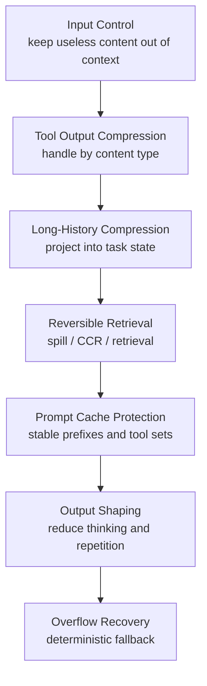

## Introduction: Token Management Is Resource Scheduling

In ordinary LLM applications, token management often looks like cost optimization: shorten the prompt, generate a shorter answer, and the bill goes down.

Agents are different. An agent keeps reading files, running commands, searching code, calling MCP tools, preserving prior decisions, and recovering after failed attempts. Its context is not a one-off prompt. It is a changing task working set.

The real question is therefore not whether we should give the model more context. The system has to make a decision on every turn: what must enter the model now, what can be compressed, what should move out of context while keeping a retrieval path, and what must not be touched because it would break prompt caching.

A coding agent may keep reading files, running tests, inspecting git diffs, and calling external services in the same session. Every model call carries the system prompt, tool definitions, conversation history, tool results, and the user's latest request. If reasoning or thinking mode is enabled, output tokens also become a meaningful part of the cost.

This is why Anthropic's article on [advanced tool use](https://www.anthropic.com/engineering/advanced-tool-use) discusses the token cost of tool definitions directly. In its example, GitHub, Slack, Sentry, Grafana, and Splunk MCP servers together can make dozens of tool definitions consume tens of thousands of tokens before the task even starts. The closer an agent gets to a real engineering environment, the less token pressure can be solved by simply "writing a shorter prompt."

The more important point is that tokens are not only a billing issue. They affect at least four things:

- **Latency**: longer inputs take longer to process.
- **Context window**: old tool outputs and history crowd out the information that matters now.
- **Decision quality**: too many tools and too much noisy information can make the model pick the wrong tool or focus on the wrong signal.
- **Recovery ability**: if context overflows and the system lacks a good compact / retry path, the task may stop outright.

More precisely, token saving in agents is not a single compression trick. It is a system design problem around "carry less, compress, retrieve, cache, generate less, and recover."

Good token management is not about making the model see less. It is about making the model see the most useful, recoverable, and cache-friendly information for the current turn.

## Where Agent Tokens Go

Before discussing optimization methods, it helps to break down where tokens are spent.

In one agent call, input tokens usually come from several sources:

| Source | Description | Common problem |
| --- | --- | --- |
| System prompt | Role, rules, tool constraints, environment information | Dynamic content breaks prompt cache |
| Tool definitions | Tool schemas, parameter descriptions, MCP tool lists | Persistent cost grows quickly as the tool pool expands |
| Conversation history | User requests, assistant replies, prior tool calls | Grows fast in long sessions |
| Tool results | File contents, command output, search results, API responses | Most likely to contain large low-value blocks |
| Retrieved context | RAG chunks, docs, web pages, dependency information | Retrieval quality is unstable |
| Images / artifacts | Images, base64, structured attachments | Single items can be expensive and easy to misestimate |

Output tokens mainly come from:

- Final answers.
- Model reasoning / thinking.
- Repeated explanations of existing context.
- Full echoes of code and diffs.
- Restatements of tool results.

There is also an indirect cost that is often underestimated: **prompt cache miss**. If a system rewrites a cacheable prefix in order to compress the current request, it may save a few hundred tokens while losing cache-read benefits over tens of thousands of tokens. For long sessions or multi-subagent scenarios, that cost can be much larger than the local compression win. Anthropic's [prompt caching documentation](https://platform.claude.com/docs/en/build-with-claude/prompt-caching) treats block-level cache breakpoints as an explicit API capability. Many token optimizations are ultimately constrained by cache boundaries.

So agent token management cannot only ask, "How many tokens did this turn save?" It also has to ask:

- Can this information be found again later?
- Does compression damage the task state the model needs to continue?
- Does it affect prompt caching?
- Does it introduce extra tool calls or retries?
- Does it make error recovery harder?

The rest of this article covers seven classes of methods.

## Method 1: Keep Useless Content Out of Context

The cheapest token is the token that never enters context.

This sounds simple, but in agent systems it is often the most effective first line of defense. Many wasted tokens are decided before model inference, at the moment tool results are admitted into context.

A typical example is file reading. If a `Read` tool dumps an entire file into context by default, a few thousand lines of code can burn through the budget quickly. But most of the time, the model does not need the whole file at once. It needs the region around a function, the area referenced by a stack trace, or the first few hundred lines to understand structure.

A better design is therefore:

- File reads support `offset` and `limit`.
- Maximum line and byte counts are enforced by default.
- Very large files require explicit paged reads.
- Command output uses a bounded buffer.
- Search results are capped by count and length.
- Large tool results return only a preview and a path.

Evot has several built-in limits of this kind. `ReadFileTool` reads at most 2000 lines or 50 KB per call, and supports `offset` / `limit`. The Bash tool truncates long lines, shows only the last 2000 lines or 50 KB, and writes the full output to spill storage when needed. This prevents one `cat`, one test log, or one package manager output from blowing up the context.

Claude Code-style coding agents use a similar pattern. Large tool results are written to disk, and the model receives a summary plus a file path so it can read the full content later if needed. [Gemini CLI](https://github.com/google-gemini/gemini-cli) also truncates large outputs and stores them in files.

A more aggressive approach is to keep intermediate tool results out of model context entirely. Anthropic's [Programmatic Tool Calling](https://platform.claude.com/docs/en/agents-and-tools/tool-use/programmatic-tool-calling) points in this direction: the model writes orchestration code, the code calls multiple tools and processes large intermediate results, and only the aggregated output is returned to the model. The saving is not one tool result, but the entire chain of intermediate tokens across a multi-step tool workflow.

The key mechanism here is not "truncation." It is "admission control." It turns unbounded input into a paged interface that can be explored further.

There is a cost, though: the model may not know that the full information still exists. If the system only says "content too long, truncated," the model may assume the missing content is unavailable. A better return shape should tell the model:

- How large the original output is.
- Which slice is currently shown.
- Where the full content is stored.
- How to keep reading.

This is why "carry less useless content" and "reversible retrieval" have to be designed together.

## Method 2: Structurally Compress Tool Outputs

Tool output is not ordinary text.

A common mistake is to apply the same head/tail truncation to every long output. That saves tokens, but it also destroys structure. For example:

- In a JSON array, the important information may be the outliers, not the first few items.
- In logs, the important information is error lines, warning lines, failed test names, and nearby context.
- In search results, file paths, line numbers, grouping, and relevance matter.
- In git diffs, files, hunks, added/deleted lines, and semantic location matter.
- In HTML, many tokens may be navigation, styles, or scripts rather than the main content.

Mature systems therefore start by identifying the content type and then choosing a matching compression strategy.

Evot's Bash Slim filters are a runtime-level tool-output compression layer. They post-process successful command output with generic head/tail truncation, JSON compression, git diff/show/log/status compression, and ack-style collapse for successful commands such as `git add`, `git commit`, `git push`, and package installs. Failed commands bypass Slim because error output is often the key signal needed to recover the task.

[Headroom](https://github.com/chopratejas/headroom) turns this idea into a more general middleware. Its `ContentRouter` detects JSON arrays, source code, search results, build logs, git diffs, HTML, tabular data, plain text, and mixed content, then routes them to different compressors. `SmartCrusher` handles JSON-array and tool-output compression; the current implementation has moved to Rust/PyO3. It first tries lossless compaction, uses a more compact tabular representation when the data fits, and falls back to lossy row dropping when necessary.

The principle behind this design is: **compression should understand content shape**.

For example, JSON tool outputs often repeat the same field names many times. Passing a thousand objects directly to the model wastes tokens on repeated keys. A better approach may extract the schema, keep representative samples, preserve outliers, and store recoverable full content externally. Log compression is different: it should not simply keep the first N lines. It should preserve errors, stacks, failed tests, and surrounding context.

The risk of structured compression is also clear: it may misjudge what matters.

Many systems therefore protect several categories of content:

- The user's latest input.
- System / developer messages.
- Recently edited code.
- The code block currently under analysis.
- Small error outputs.
- Failed command results.

This reflects an important engineering tradeoff: token saving must not outrank task recovery. Error output may look long, but it is often the only clue for the next fix.

## Method 3: Turn Long History into Task State

The main problem in a long session is not one oversized tool output. It is the continuous accumulation of history.

If the system sends all old messages back to the model verbatim, context will eventually overflow. But if it simply drops old messages, the model loses the task goal, attempted approaches, modified files, and key constraints. Anthropic's [context windows documentation](https://platform.claude.com/docs/en/build-with-claude/context-windows) also makes the same point: a larger context window does not automatically produce better results, and as token count grows, content selection becomes increasingly important.

Long-running agents therefore need a history projection mechanism: turn old conversation into task state.

The keyword here is not "summary." It is "state." A chat summary often looks like this:

> The user asked the assistant to fix a test issue. The assistant looked at some files, ran some commands, and made some changes.

That kind of summary is not very useful for continuing the task. A useful summary should preserve:

- The user's goal.
- Completed requests.
- Files that were read.
- Files that were modified.
- Key decisions.
- Current blockers.
- The assistant's latest conclusion.
- The next step.

Evot's compaction is a runtime-native design in this style. The app layer persists an append-only transcript, while the engine layer performs per-run context reduction. Under normal conditions, the engine checks provider usage before a prompt or after a response and decides whether compaction is needed. The compaction planner keeps a pinned head and retained tail, and converts old middle messages into a structured memory summary. The app layer then records a control point through `TranscriptItem::Compact`, and later context projection starts from that compact record rather than replaying the full early transcript.

Two details matter in this design.

First, the original transcript is not gone. It remains append-only for audit and review. The optimized object is the "context view for the next model call," not the underlying record of truth.

Second, the summary is task state, not a natural-language recap of a chat. It preserves completed user requests, read/modified files, assistant decisions, environment discoveries, split-turn context, the last assistant conclusion, and the previous summary.

Claude Code's context compression shows a similar layered pattern. From prior harness analysis, it does not rely on one kind of compact. It has multiple levels, from lightweight snip and microcompact to autocompact, reactive compact, and context collapse. Similar structured summaries often explicitly store fields such as Goal, Progress, Decisions, Files, and Next Steps.

The core judgment behind this method is:

> A good summary is not a summary of the chat. It is a compression of the state needed to continue the task.

Of course, every summary loses information. That is why it should be paired with an append-only transcript, spill files, or a retrieval mechanism, rather than becoming the only source of truth.

## Method 4: Large Content Must Be Reversible, Not Just Dropped

The more aggressive compression becomes, the more it needs reversibility.

If a system merely truncates or discards old content, the model can only guess when it later needs a detail from that content. Once the guess is wrong, later tool calls and code edits can drift away from the task.

Many agent systems therefore move "large content" out of context while preserving a way to get it back.

Evot does this with spill-to-disk. Large tool outputs are written into the session's `tool-results/` directory. The model sees the output size, the spill file path, a preview, and an instruction that it can use `Read` with offset/limit to inspect the full content. This design is direct: it does not need to add a hidden retrieval tool, because the model already has file-reading capability.

Headroom's approach is closer to general compression middleware. Its CCR, or Compress-Cache-Retrieve, stores original text in a local compression store, inserts markers such as `<<ccr:HASH ...>>` into the compressed output, and injects a `headroom_retrieve` tool into the model's tool list when needed. If the model decides the compressed view is insufficient, it can call the retrieval tool to fetch the full content or search within the original.

Claude Code's large tool output spilling belongs to the same family. The model does not need to carry the full content on every turn. It only needs to know that a file exists and can be read later.

The common shape is:

```text
large content
  -> move it out of context
  -> keep a summary / preview / marker
  -> store the original externally
  -> let the model retrieve it on demand
```

This is the basic form of reversible compression.

The benefit is obvious: the system can compress more boldly because compression is not final deletion. If useful information is needed later, it can still be retrieved through tools.

But this also has costs:

- External storage lifecycle must be managed.
- The retrieval path must be made clear to the model.
- Extra tool calls may be introduced.
- If retrieval is implemented by injecting a new tool, it can affect tool-list stability and prompt cache.
- Too many retrieval markers can pollute context.

Different architectures will therefore make different tradeoffs. Evot, as a runtime, can reuse the existing `Read` tool and session spill directory. Headroom, as middleware, does not own the host agent's file semantics, so it more naturally introduces a CCR store and `headroom_retrieve`.

This also shows why token management is strongly tied to system position. A runtime-native design and a proxy/middleware design do not have to look the same.

## Method 5: Protect the Prompt Cache

Many token optimization discussions only look at input length and ignore prompt cache.

For providers that support prompt caching, stable prefixes are critical. In a long session, if the system prompt, tool definitions, and early messages can hit cache, the actual cost of the current turn can be much lower. Conversely, if an optimization rewrites a cacheable prefix, it may invalidate a large cached region.

This creates a counterintuitive situation: compression does not always save money.

Suppose a system compresses an old message from 5000 tokens to 1000 tokens. It seems to save 4000 tokens. But if the rewrite happens inside a cache-hot zone and invalidates a 50000-token cached prefix, total cost may increase instead.

Mature systems therefore treat prompt cache as part of token management.

Evot inserts `__SYSTEM_PROMPT_DYNAMIC_BOUNDARY__` in the system prompt builder so dynamic parts such as date, mode, sandbox, and variables appear after a stable static prefix. Anthropic requests add cache breakpoints for the stable system prompt prefix, the last tool definition, and the second-to-last message. When an OpenAI-compatible provider supports it, Evot can also send `prompt_cache_key`, using the session id as the key.

Headroom's source also shows a cache-safety orientation. Its README/wiki previously described strategies for moving volatile content out of the cacheable prefix, but the current `CacheAligner` source has changed to detector-only behavior: it detects UUIDs, ISO timestamps, JWT-like tokens, hex hashes, and other volatile content, then warns instead of rewriting the system prompt. This suggests the implementation now gives higher priority to "do not break the cache-hot zone."

Headroom also has finer cache-protection logic:

- Pinning compressed content to avoid repeated compression changing bytes.
- Sticky injection of the retrieval tool once a session has used CCR, so the tool list does not toggle between turns.
- Frozen-prefix protection.
- Optional net-cost gating: only modify content when compression savings exceed the estimated cache-invalidation cost.

Some Claude Code mechanisms can also be read through the prompt-cache lens. Fork SubAgent shares the parent agent's rendered prompt bytes, allowing multiple child agents to share most of the prefix. ToolSearch loads tool schemas on demand, reducing long-lived tool-definition context and keeping the current working set smaller. Anthropic's official [Tool Search Tool documentation](https://platform.claude.com/docs/en/agents-and-tools/tool-use/tool-search-tool) describes `defer_loading` in the same direction: tools are discoverable first and expanded into full definitions only when needed.

This topic has also entered research. The paper [Don't Break the Cache](https://arxiv.org/abs/2601.06007) evaluates prompt caching in long-horizon agentic tasks. One conclusion is that caching strategy cannot be naive full-context caching; it must design dynamic content, tool results, and cache block positions together.

The engineering principle is:

> Token saving must count not only the input tokens reduced in this turn, but also the cost of cache misses.

This is why some seemingly "smarter" compression should not be enabled by default. If it rewrites the cache-hot zone, it must prove that its benefit is greater than the cache loss.

## Method 6: Output Tokens Need Management Too

Many systems focus on input tokens first and only later realize that output tokens matter just as much.

The reason is simple: output tokens are often more expensive, and once they are generated, they have already been billed. You cannot wait until the model finishes and then say, "This part was too verbose, deleting it should make it free." Output-token optimization has to happen on the request side, before generation.

In agent scenarios, output-token waste often appears in several forms:

- The model repeatedly explains what it just saw after every tool call.
- Code or diffs already present in context are echoed in full.
- Mechanical continuation still uses high reasoning effort.
- Thinking blocks are repeatedly carried back into history.
- Answers are filled with preambles, postambles, and generic summaries.

Evot applies a basic but important optimization: before sending history back to the provider, it strips previous `Content::Thinking` blocks by default, avoiding repeated replay of expensive internal reasoning text. For some Anthropic-compatible providers that require thinking passback, it keeps the necessary exceptions. Evot also has execution limits, a doom-loop detector, a thinking-only guard, and other loop guards to prevent unbounded consumption. Claude API's [context windows documentation](https://platform.claude.com/docs/en/build-with-claude/context-windows) separately describes token accounting and multi-turn passback rules for extended thinking, which shows that thinking tokens are now an explicit object in context engineering.

Headroom's `OutputShaper` handles output tokens more directly. It has two main techniques.

The first is verbosity steering. It appends stable, short style instructions to the end of the system prompt, asking the model to skip preambles/postambles and avoid repeating code, diffs, or tool output that is already in context. It appends to the end rather than the beginning to avoid disrupting the stable prompt-cache prefix as much as possible.

The second is effort routing. Many turns in an agent loop are mechanical continuations after clean `tool_result`s: a file was just read, a test just ran, or a command succeeded. These turns may not need the highest reasoning effort. Headroom checks whether the final user message structurally contains only non-error tool results. If so, and the request already has an explicit `output_config.effort`, it can lower effort to `low`. For legacy thinking config, it can clamp `thinking.budget_tokens` down to the API floor.

Several safety boundaries matter:

- Do not inject new effort fields into requests that do not support effort.
- Do not turn off the thinking type.
- Do not lower effort for error continuations, because the model needs to reason about failures.
- Do not lower effort for a new user ask.

The value of output shaping is that it treats output tokens as a request-design problem, not as something to clean up afterward.

There is still a tradeoff. Over-compressing output can damage collaboration. For code review, architecture design, and teaching explanations, the user may need reasoning and context. For mechanical continuations, simple status updates, and continuation after a successful tool call, shorter output is usually better.

So the better direction is not globally "shorter is always better." It is to tune output by turn type and user preference.

## Method 7: Overflow Recovery Needs a Deterministic Fallback

The most dangerous context-management scenario is overflow recovery.

Under normal conditions, the system can compact proactively as it approaches a threshold. In the real world, there will still be estimation errors, provider limit changes, sudden explosions in tool output size, or a request that directly hits prompt-too-long.

At that point the system cannot simply say, "Ask the model to summarize the history." The problem is precisely that the current context may already be too long to send.

Evot handles this by attempting compact-and-retry after provider usage indicates overflow. If it still overflows, it returns a runtime error to avoid an infinite loop. More importantly, overflow recovery uses a deterministic emergency summary, so the recovery path does not depend on another successful LLM summary call.

This is different from normal compaction. Normal compaction can use an LLM summary because it happens while the system still has enough room. Emergency recovery must be more conservative and more deterministic.

Claude Code's reactive compact and breakers reflect a similar principle. If automatic compression keeps failing, the system needs to stop trying rather than spend tokens forever on failed compression attempts.

The general principle is:

> The emergency path must not depend entirely on another successful LLM call.

A deterministic emergency summary may be less information-dense than an LLM summary, but its value is reliability. It should not replace normal compaction, but it should exist as the final fallback.

## A Unified Framework: Agent Token Management Stack

Putting the seven methods together gives us an Agent Token Management Stack.



These layers are not mutually exclusive. They are defenses at different positions.

| Layer | Goal | Typical mechanisms |
| --- | --- | --- |
| Input control | Keep useless tokens out of context | read limit, output cap, tool schema on-demand |
| Tool output compression | Reduce low-value tool results | JSON/log/diff/search/html compressors |
| Long-history compression | Turn old conversation into task state | structured summary, context projection |
| Reversible retrieval | Recover after aggressive compression | spill file, CCR, retrieval tool |
| Cache protection | Avoid breaking a large cache to save a small amount | dynamic boundary, sticky tools, net-cost gate |
| Output shaping | Reduce redundant generation | verbosity steering, effort routing, thinking strip |
| Overflow recovery | Guarantee an exit path in extreme cases | deterministic summary, compact retry, breaker |

More specifically, token management depends on where the system sits. Different positions can observe different information and intervene at different times.

| System position | Problems it is best suited to handle | Representative practices |
| --- | --- | --- |
| Agent runtime / harness | Long-history compression, session projection, overflow recovery | Evot keeps the factual record with append-only transcript + compact record, while projecting a shorter context view; Claude Code uses multi-level compaction and reactive compact |
| Tool execution layer | Tool output caps, large-result spilling, reversible retrieval | Evot's `ReadFileTool` / Bash caps and spill file + `Read`; Claude Code / Gemini CLI spilling large outputs to files and reading them later |
| Compression middleware / proxy | Content-type detection, cross-client compression, output shaping | Headroom uses `ContentRouter`, `SmartCrusher`, CCR, and `OutputShaper` before requests enter the model |
| Prompt assembly layer | Prompt cache protection, tool definitions loaded on demand | Evot's dynamic boundary / cache breakpoints; Headroom's sticky tools and net-cost gate; Claude's Tool Search Tool |

This framing makes concrete projects complementary rather than interchangeable. They cover different layers of the Agent Harness. The valuable lesson is not to copy one implementation, but to decide where your own system can intervene and then choose the corresponding token-management mechanism.

## Conclusion: Token Management Will Become a Core Agent Harness Capability

In early LLM applications, token management often looked like cost optimization: send a shorter prompt, generate a shorter answer.

Agents are different. They call tools, read and write files, execute commands, preserve long histories, launch subtasks, and integrate with MCP and external APIs. Their context is not a static prompt. It is a changing task working set.

In such systems, token management will increasingly become a core Agent Harness capability. It affects cost, but also reliability, recoverability, latency, and safety boundaries.

A mature Agent Harness needs to keep answering these questions:

- Which information should enter the current context?
- Which information should be compressed?
- Which information should move out of context while keeping a retrieval path?
- Which content must remain stable because it protects prompt cache?
- Which outputs does the user actually need, and which are just habitual verbosity?
- When context overflows, does the system have a deterministic recovery path?

Good token management is therefore not about letting the model see less information. It is about making sure the model sees the information best suited to the current task on every turn.

This may be one of the biggest differences between agent engineering and ordinary LLM applications. Ordinary applications can treat the prompt as a one-time input. Agents have to treat context as a finite resource to be scheduled. The systems that manage that resource better will run longer, more reliably, and more cheaply.

## References

### Projects and Source Code

- [Evot GitHub](https://github.com/evotai/evot): source reference for the Evot runtime, tool-output handling, compaction, and prompt-cache mechanisms discussed in this article.
- [Headroom GitHub](https://github.com/chopratejas/headroom): a general token compression layer with SDK, proxy, MCP, CCR, ContentRouter, SmartCrusher, and related mechanisms.
- [Gemini CLI GitHub](https://github.com/google-gemini/gemini-cli): Google's open-source terminal AI agent.
- [Claude Code Docs: Overview](https://code.claude.com/docs/en/overview): official Claude Code overview covering terminal, IDE, desktop, web, tool, MCP, and multi-agent capabilities.

### Official Docs and Engineering Articles

- [Anthropic: Introducing advanced tool use on the Claude Developer Platform](https://www.anthropic.com/engineering/advanced-tool-use): introduces Tool Search Tool, Programmatic Tool Calling, and Tool Use Examples, including tool-definition token cost and on-demand loading benefits.
- [Claude API Docs: Tool Search Tool](https://platform.claude.com/docs/en/agents-and-tools/tool-use/tool-search-tool): official documentation for `defer_loading`, `tool_reference`, server-side tool search, and custom tool search.
- [Claude API Docs: Programmatic Tool Calling](https://platform.claude.com/docs/en/agents-and-tools/tool-use/programmatic-tool-calling): describes using code to orchestrate tool calls so intermediate results do not directly enter model context.
- [Claude API Docs: Prompt caching](https://platform.claude.com/docs/en/build-with-claude/prompt-caching): explains prompt cache, TTL, and block-level cache breakpoints.
- [Claude API Docs: Context windows](https://platform.claude.com/docs/en/build-with-claude/context-windows): explains context windows, extended thinking, thinking block passback, and context overflow behavior.

### Papers and Research Material

- [Don't Break the Cache: An Evaluation of Prompt Caching for Long-Horizon Agentic Tasks](https://arxiv.org/abs/2601.06007): evaluates the cost and latency benefits of prompt caching in long-horizon agentic tasks, and discusses dynamic content and cache block design.
- [Prompt Cache: Modular Attention Reuse for Low-Latency Inference](https://arxiv.org/abs/2311.04934): earlier research on prompt cache / attention reuse.
- [Dive into Claude Code: The Design Space of Today's and Future AI Agent Systems](https://arxiv.org/abs/2604.14228): analyzes the agent-system design space based on public Claude Code source, including compaction, permissions, and tool loops.
