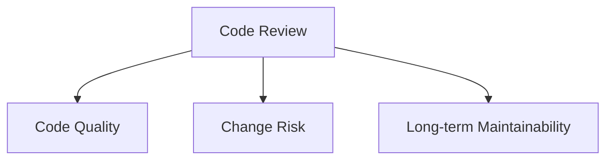
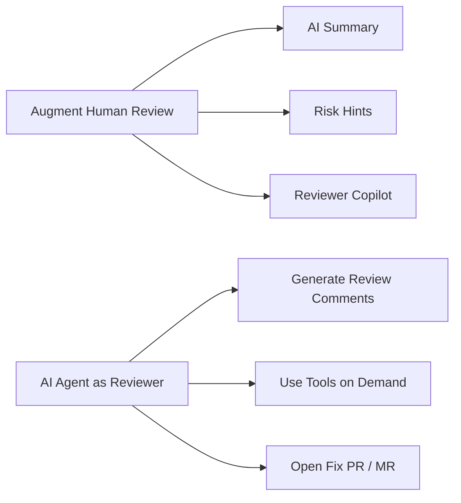
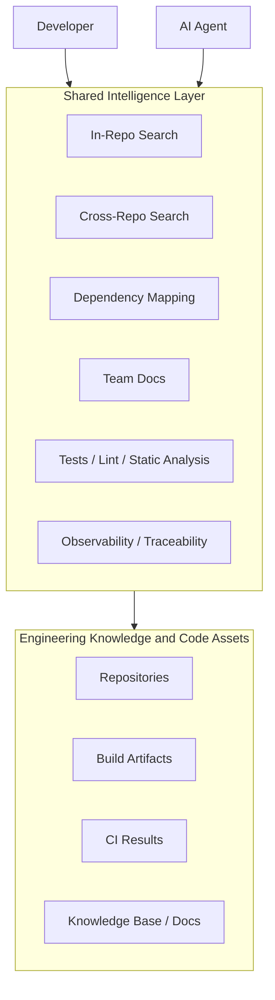
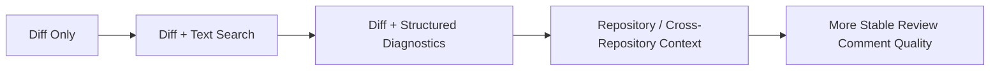
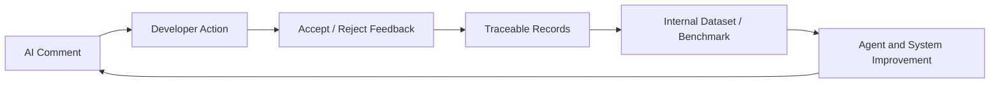

Recently, we ran an internal AI code review pilot across hundreds of repositories. The pilot itself was built around agentic coding tools such as [Claude Code](https://docs.anthropic.com/en/docs/claude-code/overview). If you want to bring this kind of agent into real engineering workflows, permission boundaries, tool use, and secure deployment quickly become first-order concerns of their own, as Anthropic's [secure deployment guide](https://platform.claude.com/docs/en/agent-sdk/secure-deployment) makes clear.

At the beginning, the most natural question was straightforward: can AI directly participate in code review, or even replace part of a human reviewer's work?

If you only look at demos, the answer seems almost obvious. Today's models can already read diffs, summarize changes, point out some visible risks, and even generate fairly plausible review comments. Go one step further, wrap the model in an agent loop, let it reason across multiple turns, call tools on demand, and gather more context, and the path looks even more promising.

But once we actually started doing this, one conclusion became hard to avoid: **the hardest part of AI code review is not getting the model to say something. It is getting the model to know enough, and getting developers to trust what it says.**

This article is a record of a few judgments that became clearer to us through this pilot.

## What Problem Does Code Review Actually Solve?

If you do not answer this question first, the rest of the discussion drifts very quickly.

On the surface, code review looks like a process for leaving comments. In practice, it solves a more fundamental problem: code quality, change risk, and long-term maintainability. It is not just a mechanism for one person to "give feedback" to another. It is a quality gate before code lands on the main branch, a place where teams detect problems, transfer context, and reinforce engineering constraints.

So the real questions are usually not "Did we leave comments?" but:

- Did this change introduce risk?
- Will this code still be maintainable later?
- Can team conventions be enforced consistently?
- Can developers understand the real impact of a change with less cognitive load?

From that perspective, the real end user of AI code review is the developer, not just the reviewer in the traditional sense.

The distinction in roles matters here. In the setup we are discussing, the AI agent is effectively acting as a reviewer: it generates review comments. But the actual consumer of those comments is often the developer, meaning the person who submitted the code or the person who now has to modify it. In other words, the product is not only serving "who reviews." It is serving "who has to interpret and act on the review."

That directly changes the product objective. If the system produces many comments but developers cannot tell which ones matter and which ones are false positives, it is just creating a new kind of noise. If instead it helps developers understand risk faster and reduces cognitive burden, then it is valuable even if it produces fewer comments.

## Two Paths in AI Code Review

From what we see in the market and in our own work, AI code review is roughly splitting into two paths.

The first path is **augmenting human review**.

This path is easier to ship. It does not ask AI to make the final judgment. Instead, AI acts more like an intelligent workbench: it reads the diff, generates summaries, highlights potential risks, and helps the reviewer get oriented before writing comments. The reason is not complicated. This path has more tolerance for error. Even when the AI output is imperfect, it is still mostly auxiliary information, and the final judgment stays with a human.

The second path is **letting the AI agent act as the reviewer**.

Here the agent is not just summarizing the diff. It is generating actual review comments. Taken further, it may even attempt fixes and open a follow-up PR or MR.

The upside of this path is obviously larger because it gets closer to automating review itself. But the system requirements are also much higher. Once the comment is directed at a developer, it is no longer just a lightweight summary. It becomes a recommendation that can influence an engineering decision. At that point, the question is no longer "Can the model write comments?" but "What is the model basing those comments on?"

From a product-shape perspective, [CodeRabbit](https://www.coderabbit.ai/), [Graphite](https://graphite.dev/docs/ai-reviews), and the review workflows Cursor has continued to emphasize after [Graphite joined Cursor](https://cursor.com/blog/graphite) are also closer to this path. They are not just producing summaries. They are directly generating review comments. In practice, many products straddle both paths, but their center of gravity is different.

## The Hard Part Is Not Comment Generation. It Is Context Supply.

This has been the strongest takeaway in our practice.

If you only review a diff, the ceiling is low. A diff tells you what changed. It does not reliably tell you what the change actually affects.

Take a common example: a service changes an API field, or adjusts a piece of internal logic. If the AI only sees the diff in the current repository, it may notice local issues such as inconsistent naming, weak error handling, or missing tests. But it may still have no idea whether that API is consumed by other repositories, whether it maps to a PyPI package or a Maven artifact, whether there is an internal document that constrains the change, or whether an existing automated test pipeline somewhere else is already covering part of the risk.

That is why we increasingly prefer to frame AI code review through a larger lens: **its core capability should not just be "a reviewer agent that can write comments." It should be a shared intelligence layer between developers and agents.**

We are not using the phrase "shared intelligence layer" just to introduce a new term. It is useful because it describes the problem precisely. In 2026, Sourcegraph explicitly framed its direction as a [shared intelligence layer for developers and AI agents](https://sourcegraph.com/blog/a-new-era-for-sourcegraph-the-intelligence-layer-for-ai-coding-agents-and-developers). We think that phrasing is worth borrowing because it points to something important: what humans and agents are both missing is often the same layer of context.

That shared intelligence layer is doing two things:

First, it provides the agent with more useful context, or with better ways to retrieve that context.

Second, those same context capabilities should also serve developers directly, not just the agent.

In practice, that layer includes at least the following:

- In-repository search for understanding local impact
- Cross-repository search for external dependencies and downstream effects
- Mappings between repositories and build artifacts such as PyPI packages or Maven dependencies
- Team documents, conventions, and accumulated operational knowledge
- Test, lint, and static analysis signals that should become part of review reasoning rather than parallel UI clutter
- Observability, traceability, and historical change data that help explain why a comment was generated

Once you look at the problem this way, a lot of things that previously looked like "nice-to-have features" turn out to be infrastructure.

This is also why cross-repository search, global code linkage, and dependency mapping matter so much. In a small single-repo project, local context may be enough for AI to survive. In a real enterprise environment, codebases are often multi-repo, multi-language, and multi-artifact. Especially in split-repo organizations, the actual blast radius of a change is often outside the current PR entirely, in another service, another repository, or another build artifact. Whoever can supply that context to the agent more reliably has the higher ceiling. Sourcegraph's discussion of [cross-repository code navigation](https://sourcegraph.com/blog/cross-repository-code-navigation) makes the same point from a technical angle: the challenge is not just "searching wider," but knowing precisely what symbol, version, and dependency relationship a piece of code actually refers to.

## Why Code Intelligence Matters

If you keep decomposing the problem, you quickly hit a more concrete question: where does that context actually come from?

We previously spent time studying Code Intelligence as its own topic. At the time, the emphasis was still code navigation: hover, go-to-definition, find references, cross-file navigation, cross-repository navigation, and even cross-language navigation. At first glance, that sounds like a problem for IDEs and code search platforms. But after working on AI code review, we have become increasingly convinced that these capabilities are not peripheral. They are core infrastructure for context supply.

The reason is simple. When developers review code, they do not actually just stare at a diff. They keep answering a chain of questions: where is this function defined? who else calls it? is this field generated somewhere? is there an implicit relationship between this config file and that Java class? will this change affect a downstream service in another repository?

Historically, humans answered those questions using IDEs, code search systems, and documentation. What changed is that we now have a new consumer of the same information: the AI agent. In other words, AI code review did not invent a new demand for Code Intelligence. It turned an existing developer need, code understanding, into a capability the system now has to expose and serve reliably.

That is why we see Code Intelligence not as an optional enhancement for AI code review, but as one of the harder layers inside the shared intelligence layer.

From an implementation perspective, the key is not choosing one magic technology. The key is whether code-understanding capability can be supplied at scale. Real-time semantic systems such as [LSP](https://microsoft.github.io/language-server-protocol/) are already very effective in IDEs. At platform scale, especially across repositories and languages, that often pushes you toward indexed approaches such as [LSIF](https://code.visualstudio.com/blogs/2019/02/19/lsif), [SCIP](https://sourcegraph.com/blog/announcing-scip), or alternative tradeoff points such as GitHub's [Stack Graphs](https://github.blog/2021-12-09-introducing-stack-graphs/).

For AI code review, these are not just internal details from the code navigation world. They will decide whether the shared intelligence layer can operate at reasonable cost over time. Because the expensive part is rarely a single definition lookup. The expensive part is keeping semantic information updated, linked, and reusable across a living codebase.

## Tools Are Not the Point. The Real Question Is How to Supply Useful Context.

This is where another common question appears: should the system rely on LSP, static analysis, vector retrieval, or just an LLM plus text matching?

Our view is that these are not mutually exclusive routes. They are all answers to the same question: **how do you deliver information that helps review quality, in the most effective way, to the agent?**

The answer will differ by language, repository shape, and engineering environment. In some cases, compiler signals and static analysis matter a lot. In others, cross-repository search and document linkage are more important. In still others, relatively plain text search solves most of the problem.

A very practical observation is that even when models are given LSP-related tools, they often do not call them frequently or reliably. They tend to prefer simpler primitives such as `read`, `grep`, and `bash`, because those tools have a more direct interaction pattern and fit current model behavior more naturally.

That does not make LSP or static analysis less valuable. It means system design should not assume the model will proactively and correctly orchestrate complex tools every time. In many cases, it is more effective to inject structured outputs directly into the working context: LSP diagnostics, lint findings, test results, and similar signals. In practice, that often works better than placing the tools on the shelf and hoping the agent uses them well.

From this angle, the value of Code Intelligence is not just "better code navigation." Cross-file navigation, cross-repository symbol linkage, references, indexes, and dependency mappings are already part of how developers understand code. AI code review simply turns them into upstream infrastructure for model reasoning.

## Trust, Evaluation, and Defensibility

If context determines the ceiling of AI code review, trust determines whether it can actually land.

One lesson we feel strongly about is this: **trust does not come from mystique. It comes from understanding limitations.** The more clearly we understand where agents like Claude Code tend to fail, where their judgment is unstable, and where they only look correct on the surface, the easier it becomes to use them in a disciplined way. The same applies to AI code review.

That means a usable system cannot just output comments. It has to answer more grounded questions: what context was this comment based on? which files did it inspect? did it reference tests, static analysis, or dependency information? is this a high-confidence recommendation, or only a heuristic flag worth another human look?

That is why observability and traceability matter so much. Without them, developers cannot build stable trust. Without stable trust, AI code review stays at demo level.

Evaluation works the same way. Public benchmarks and datasets are valuable. But in enterprise settings, what matters more is building internal datasets and benchmarks based on real repositories and real review habits. Otherwise, you do not actually know whether the system is improving efficiency, merely increasing comment volume, catching real problems, or just generating more false positives. Alibaba's [AACR-Bench paper](https://arxiv.org/abs/2601.19494) is useful here because it explicitly emphasizes repository-level context and shows how context granularity and retrieval strategy materially affect automated code review outcomes. The corresponding [dataset](https://huggingface.co/datasets/Alibaba-Aone/aacr-bench) and [code](https://github.com/alibaba/aacr-bench) are also public.

If you go one level deeper, this is also where the long-term defensibility of AI code review products is likely to come from.

Not just from a clever prompt, and not just from building a reviewer agent that sounds more human than competitors. The more durable advantage is likely to come from whether you can build a genuinely effective shared intelligence layer: one that organizes cross-repository code, dependency relationships, team documents, test signals, static analysis, and accumulated engineering knowledge in a way that benefits both developers and agents.

From a product perspective, that looks much more like engineering knowledge infrastructure than like a narrow "automatic review comment" tool.

## Questions We Still Do Not Fully Have Answers To

The first is the risk of circular validation.

If code is written by AI, then reviewed by AI, then explained by AI, and the human only rubber-stamps the result, the organization can easily drift into a shallow approval loop. That risk is real and worth designing against.

The second is whether code review will continue to exist in today's form.

We do not know. It is entirely possible that more and more "review comments" will be pushed earlier into authoring, pre-merge checks, CI pipelines, and even runtime feedback loops. But even if the specific workflow changes, the need for quality assurance and long-term maintainability does not go away. The label "code review" may change. The underlying problem does not.

## Conclusion

If the question is simply "Can AI do code review?" then the answer is probably yes, and it can already do quite a lot.

But if the question is "Why does AI code review often look strong in demos, yet struggle to create stable value in production?" then our answer is different: because the real problem is not comment generation. It is building sufficiently good context supply, evaluation loops, and trust foundations.

That is why we increasingly think about AI code review in the following way: the AI agent acting as a reviewer is only the visible surface. The deeper and more valuable work is building a shared intelligence layer between developers and agents, so that comments are grounded in real, sufficient, and traceable context.

That may be the real key to moving AI code review from something that demos well to something that actually works.

## References

- [Anthropic documentation: Claude Code Overview](https://docs.anthropic.com/en/docs/claude-code/overview)
- [Anthropic documentation: Securely deploying AI agents](https://platform.claude.com/docs/en/agent-sdk/secure-deployment)
- [CodeRabbit](https://www.coderabbit.ai/)
- [Graphite AI Reviews](https://graphite.dev/docs/ai-reviews)
- [Cursor: Graphite joins Cursor](https://cursor.com/blog/graphite)
- [Sourcegraph: A New Era for Sourcegraph: The Intelligence Layer for AI Coding Agents and Developers](https://sourcegraph.com/blog/a-new-era-for-sourcegraph-the-intelligence-layer-for-ai-coding-agents-and-developers)
- [Sourcegraph: Cross-Repository Code Navigation](https://sourcegraph.com/blog/cross-repository-code-navigation)
- [Sourcegraph: SCIP: a better code indexing format than LSIF](https://sourcegraph.com/blog/announcing-scip)
- [Language Server Protocol](https://microsoft.github.io/language-server-protocol/)
- [Language Server Index Format](https://code.visualstudio.com/blogs/2019/02/19/lsif)
- [GitHub: Introducing stack graphs](https://github.blog/2021-12-09-introducing-stack-graphs/)
- [AACR-Bench paper](https://arxiv.org/abs/2601.19494)
- [AACR-Bench dataset](https://huggingface.co/datasets/Alibaba-Aone/aacr-bench)
- [AACR-Bench GitHub repository](https://github.com/alibaba/aacr-bench)
- Public datasets: [Code-Review-Assistant](https://huggingface.co/datasets/alenphilip/Code-Review-Assistant), [Code-Review-Assistant-Eval](https://huggingface.co/datasets/alenphilip/Code-Review-Assistant-Eval), [Nutanix codereview-dataset](https://huggingface.co/datasets/Nutanix/codereview-dataset), [SWE-CARE](https://huggingface.co/datasets/inclusionAI/SWE-CARE), [CRAVE](https://huggingface.co/datasets/TuringEnterprises/CRAVE)
