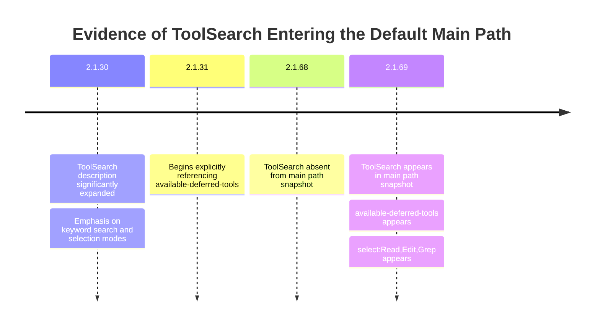
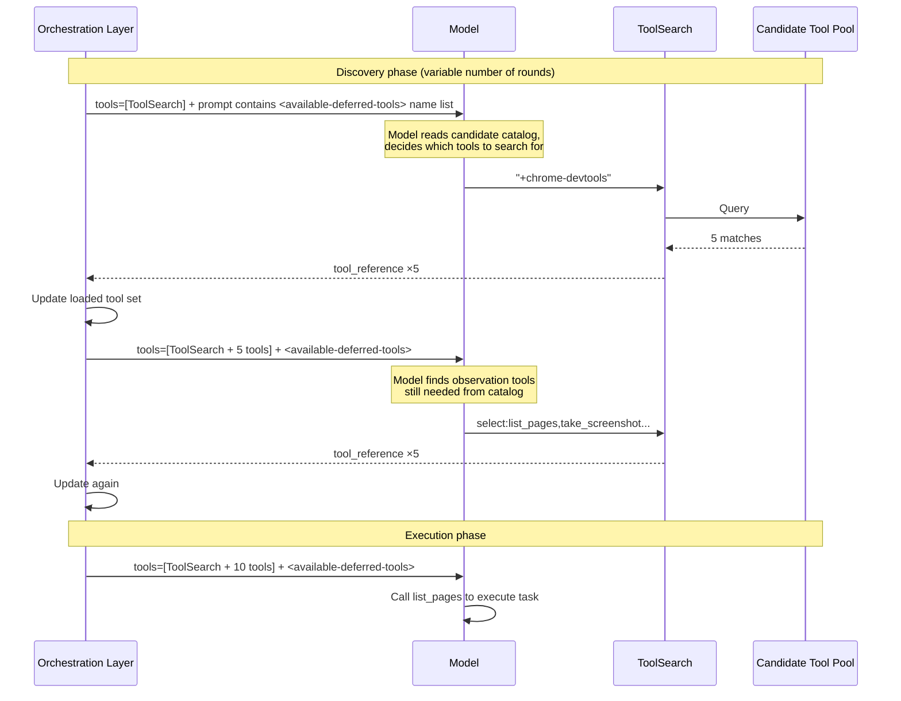

## Introduction

Starting from `2.1.69`, Claude Code's tool orchestration underwent a structural shift: the model no longer receives the full tool set at the beginning of a session. Instead, it progressively loads the tools it needs through `ToolSearch`. This mechanism deserves a dedicated breakdown because it represents a context management strategy designed for large tool pools — provide a catalog first, then load on demand.

This article draws on three categories of sources: community-maintained version snapshots and system prompt extraction projects ([claude-code-changelog](https://github.com/marckrenn/claude-code-changelog), [claude-code-system-prompts](https://github.com/Piebald-AI/claude-code-system-prompts)), Anthropic's official documentation and engineering articles, and packet capture analysis of runtime request chains. All packet capture findings are presented as sanitized structural observations only — no raw payloads or internal paths are disclosed.

## 1. Version Context: Why Start from 2.1.69

`ToolSearch` did not first appear in `2.1.69`. According to community-maintained prompt extraction projects ([claude-code-system-prompts](https://github.com/Piebald-AI/claude-code-system-prompts), [claude-code-changelog](https://github.com/marckrenn/claude-code-changelog)), `2.1.30` already included a significantly expanded ToolSearch description, and `2.1.31` began explicitly referencing `available-deferred-tools`. However, in the `2.1.68` snapshot, these structures had not yet appeared on the main path. By `2.1.69`, both `<available-deferred-tools>` and `## ToolSearch` were present in the standard prompt structure.

So `2.1.69` is better understood as a "default path switchover point": ToolSearch went from being a peripheral capability to a standard part of the session structure. Note that this conclusion is based on comparing community project prompt snapshots — there is no direct feature flag evidence at this time.

## 2. Core Mechanism: Two-Layer Tool Sets and the Discovery-Execution Pipeline

### Two-Layer Tool Sets

Claude Code maintains two semantically distinct tool collections simultaneously:

| Layer | Carrier | Function |
| --- | --- | --- |
| Candidate catalog | Tool name list in `<available-deferred-tools>` | Tells the model what tools might be available |
| Active working set | The `tools` array in the request | Determines which tools can actually be called this turn |

The candidate catalog provides only a name index — the model can see it but cannot call anything from it. The active working set is the actual executable scope. `ToolSearch` bridges the two — it lets the model pull tools from the candidate catalog into the working set.

### Discovery-Execution Pipeline

Structurally, the pipeline has two phases:

1. **Discovery phase**: The model loads needed tools via `ToolSearch`; `tool_reference` entries enter the orchestration layer's `loaded tool set`
2. **Execution phase**: Loaded tools appear in the next request's `tools` array, and the model calls them directly

The discovery phase may require only one round of `ToolSearch`, or it may take several — depending on task complexity and how familiar the model is with the tool pool. In a Chrome DevTools sample we analyzed, the model went through two rounds of discovery: the first round used `+chrome-devtools` to find 5 interaction tools (click, drag, etc.), then, finding it lacked observation tools, the second round used `select:` to add list_pages, take_screenshot, and 3 others. If the first search had returned sufficient tools, a single round would have been enough to enter the execution phase.

Note that in each request, the orchestration layer includes an `<available-deferred-tools>` name list in the prompt — this is the "menu" the model reads before deciding what to search for via `ToolSearch`. The sequence diagram below illustrates this specific sample's two-round discovery process:

A key detail: `tool_reference` entries returned by `ToolSearch` do not make tools available in the current turn. The actual tool schemas appear in the **next request's** `tools` array — loading happens during request construction in the orchestration layer. The model's available tool set does not change mid-inference.

### Request Construction Perspective

From the orchestration layer's point of view, each request is constructed roughly as follows:

1. Collect currently visible deferred tool names and write them into `<available-deferred-tools>`
2. Read the loaded tool set and combine it with `ToolSearch` to form the `tools` array
3. Send the request and wait for the model's response
4. If the model called `ToolSearch`, add the returned `tool_reference` entries to the loaded tool set
5. Return to step 1 and construct the next request

From available samples, the `loaded tool set` is a cross-turn cumulative session state that exhibits a pattern of "gradual expansion followed by stabilization." No active tool unloading has been observed so far, though whether a longer-term eviction mechanism exists requires more samples to verify.

## 3. ToolSearch Query Semantics

Based on prompt descriptions and observed packet capture behavior, `ToolSearch` supports at least three query modes:

| Mode | Syntax example | Use case |
| --- | --- | --- |
| Keyword search | `slack message` | When you don't know the exact tool name |
| Direct selection | `select:Read,Edit,Grep` | When you know the tool name and want to load it directly |
| Required keyword | `+chrome-devtools` | When you want to match a specific tool family |

An easily overlooked point: tools returned by keyword search are **already loaded** — there is no need to `select:` them again for confirmation. In our sample, the model made two `ToolSearch` calls, but the second `select:` loaded a **different batch** of tools, not a re-confirmation of the first batch.

The prompt positions `ToolSearch` in forceful terms — "MANDATORY PREREQUISITE", "HARD REQUIREMENT", "deferred tools are NOT available until you load them using this tool." This makes clear that it serves as a **gatekeeper** in the current architecture: all deferred tools must pass through it to enter the working set.

## 4. Dynamic Nature of the Candidate Catalog

Community-maintained version snapshots also reveal two types of system reminders:

- "following deferred tools are **now available**" — corresponding to MCP server connections
- "following deferred tools are **no longer available**" — corresponding to MCP server disconnections

This means the candidate catalog itself is dynamic. The search space `ToolSearch` operates on adjusts in real time with MCP server connection states. For a long-running agent system like Claude Code, managing "which tools are currently visible, searchable, and loadable" matters just as much as managing "which tools exist" — and this is one of the engineering rationales behind the three-layer split of catalog, working set, and execution.

## 5. Why Do It This Way

Anthropic's November 2025 engineering article, "[Introducing advanced tool use on the Claude Developer Platform](https://www.anthropic.com/engineering/advanced-tool-use)," provides a direct explanation.

**Context pressure.** The article describes a typical five-server scenario: GitHub, Slack, Sentry, Grafana, and Splunk totaling 58 tool definitions at approximately 55K tokens. Adding more servers quickly pushes this past 100K. With full loading, tool definitions alone consume most of the available context space.

**Quantified gains.** The same article provides comparison data: in a 50+ MCP tool scenario, traditional full loading consumes roughly 77K tokens. With on-demand loading, the Tool Search Tool itself costs about 500 tokens in the first round, plus approximately 3K tokens for the 3–5 tools discovered on demand, bringing the total to about 8.7K tokens — an 85%+ reduction in tool definition overhead.

**Selection accuracy.** The article also discloses internal test data: after introducing Tool Search, Opus 4's tool selection accuracy improved from 49% to 74%, and Opus 4.5 from 79.5% to 88.1%. With a smaller candidate set, there is less noise and a higher probability of selecting the right tool.

These three gains address three layers of the problem: token cost, available context space, and decision quality. The ToolSearch mechanism responds to all three simultaneously.

## 6. Relationship to the Official Tool Search Tool API

When understanding this mechanism, it is important to distinguish Claude Code's `ToolSearch` from the official [Tool Search Tool](https://platform.claude.com/docs/en/agents-and-tools/tool-use/tool-search-tool) in the Anthropic API. The official API actually offers two modes — a server-side built-in and a custom client-side implementation — and Claude Code's approach relates to each differently.

### Comparison with the Server-Side Built-in

The official server-side tool search (`tool_search_tool_regex_20251119` / `tool_search_tool_bm25_20251119`) works as follows: all candidate tool definitions are passed in the top-level `tools` parameter with `defer_loading: true`, the API uses dedicated block types (`server_tool_use` / `tool_search_tool_result`) in responses, and search supports regex or BM25 query syntax. The API itself handles expanding `tool_reference` entries into full tool schemas.

Claude Code's packet capture behavior diverges from this on every axis: the first round's `tools` contains only `ToolSearch`, candidate tools are exposed through an `<available-deferred-tools>` name list in the prompt (not as `defer_loading: true` entries in the `tools` array), responses use standard `tool_use` / `tool_result` blocks, and the query syntax uses custom `+keyword` and `select:name` forms. Claude Code is clearly not using the server-side built-in.

### Comparison with the Custom Implementation Pattern

The [official documentation](https://platform.claude.com/docs/en/agents-and-tools/tool-use/tool-search-tool) has a section titled "Custom tool search implementation" that describes returning `tool_reference` blocks from a standard `tool_result`. In terms of protocol shape — standard block types, client-defined search logic — Claude Code's approach closely resembles this pattern.

However, there is a key structural difference. The official custom pattern still requires that "every tool referenced must have a corresponding tool definition in the top-level `tools` parameter with `defer_loading: true`." In other words, the full schemas of all candidate tools are sent to the API in every request; the API handles the expansion of `tool_reference` into loaded schemas.

Claude Code does not do this. Candidate tool schemas are absent from the initial `tools` array. The orchestration layer maintains them locally and injects them into the next request's `tools` array after `ToolSearch` returns matching `tool_reference` entries. The expansion responsibility sits in the orchestration layer, not the API.

### Where the Expansion Happens: A Summary

| Aspect | Server-side built-in | Official custom pattern | Claude Code |
| --- | --- | --- | --- |
| Candidate schemas in `tools`? | Yes, with `defer_loading: true` | Yes, with `defer_loading: true` | No — only names in prompt |
| Who expands `tool_reference`? | API | API | Orchestration layer |
| Response block types | `server_tool_use` / `tool_search_tool_result` | Standard `tool_use` / `tool_result` | Standard `tool_use` / `tool_result` |
| Query syntax | Regex / BM25 | Client-defined | `+keyword` / `select:name` |

A more precise conclusion: Claude Code borrows the `tool_reference` concept and the "search-then-load" flow from the official custom implementation pattern, but goes a step further — it moves schema storage and expansion entirely into the orchestration layer, avoiding the need to send all candidate schemas to the API. This makes the mechanism fully client-side: the API sees only the tools that the orchestration layer has already decided to load.

## 7. Engineering Takeaways

Setting aside Claude Code's specific implementation details, this mechanism embodies three broadly applicable design principles.

**Catalog-execution separation.** Expose the candidate scope first, then decide which capabilities enter the active working set. This pattern has parallels across many domains: lazy loading in frontends, index-then-fetch in databases, directory entries versus inodes in file systems.

**Discovery-invocation separation.** Split "finding the right tool" and "actually using the tool" into two independent phases. This makes the tool selection process itself observable and controllable, and gives the system an opportunity to insert permission checks, state updates, and other logic between the two phases.

**Working set management.** Similar to the operating system concept of a working set — rather than keeping all pages resident in memory, dynamically maintain a hot set based on current access patterns. What Claude Code does within the "finite memory" of its context window is conceptually parallel to what an OS does within physical memory.

## References

- [Anthropic official documentation: Tool Search Tool](https://platform.claude.com/docs/en/agents-and-tools/tool-use/tool-search-tool)
- [Anthropic engineering article: *Introducing advanced tool use on the Claude Developer Platform* (2025-11-24)](https://www.anthropic.com/engineering/advanced-tool-use)
- [GitHub issue #12836: *Support new Tool Search Tool beta to slash context sizes & costs*](https://github.com/anthropics/claude-code/issues/12836)
- [claude-code-changelog](https://github.com/marckrenn/claude-code-changelog) (community project maintained by @marckrenn, tracking system prompt and feature flag changes across Claude Code versions)
- [claude-code-system-prompts](https://github.com/Piebald-AI/claude-code-system-prompts) (community project maintained by Piebald-AI, extracting and documenting the complete system prompt structure of Claude Code)
