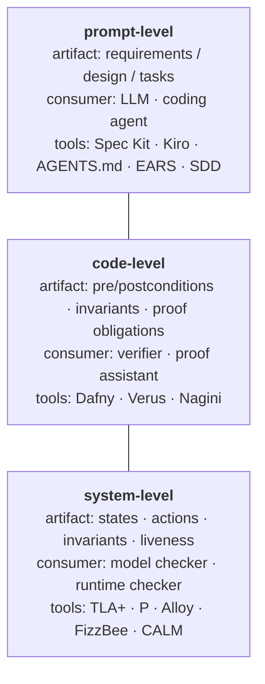
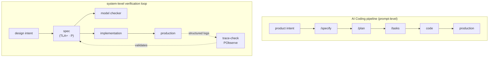
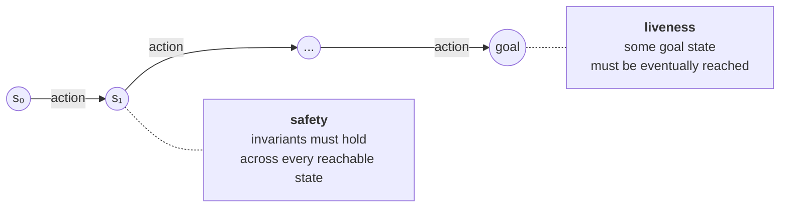
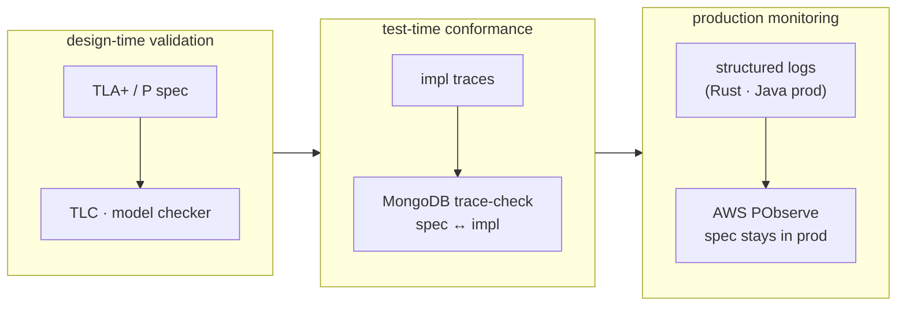

This essay starts from a personal experience: I once worked through TLA+ in a fairly serious way, and through it picked up the mathematical foundations behind formal methods — set theory, predicate logic, temporal logic, state machines / transition systems. In my own experience, those tools gave me a deeper jump in understanding complex systems — distributed systems in particular — than reading DDIA did. In the AI Coding era, "spec" has become a high-frequency word again: Spec Kit, Kiro, AGENTS.md, SDD all ask you to write requirements, design, and tasks first. But the primary consumer of these specs is an LLM, not a verifier or a model checker — they organize work, compress context, and constrain generation, but they don't verify whether the system design itself holds together. The question this essay is concerned with: as AI starts to participate in software engineering and system design, can formal methods fill the missing layer between prompt-level specs and the actual semantics of complex systems?

## Introduction: How Studying TLA+ Changed the Way I Understand Complex Systems

I came to TLA+ roughly like this — first reading through Lamport's *Specifying Systems* and the Hyperbook, then following Ron Pressler's [pron.github.io/tlaplus](https://pron.github.io/tlaplus) to pick back up the mathematical toolkit: set theory, predicate logic, temporal logic, state machines / transition systems. A few public repos came out of that learning: [tla-plus-learn](https://github.com/Stool233/tla-plus-learn) holds notes and exercises; [modelling-message-passing](https://github.com/Stool233/modelling-message-passing) models "messages can be lost, duplicated, reordered" as a state machine you can run a model checker against; [modelling-bakery](https://github.com/Stool233/modelling-bakery) is a personal model of Lamport's bakery algorithm.

I'm not doing formal-methods research. I just picked these tools up as an ordinary engineer trying to learn a language for thinking about systems. The unintended discovery: after that, the way I look at distributed and concurrent systems changed.

Before, I'd read DDIA, several distributed-systems papers, and walked through several production-incident postmortems. What those gave me was mostly a knowledge map: what quorum is, what linearizability is, roughly how leader election works, what trade-offs surface when networks partition. It tells you "here are the mountains on this map" — enough that, faced with an unfamiliar system, you're not entirely speechless.

What TLA+ gave me was at a different layer. It forced me to translate "what is this system" into four concrete things: what is the state space, what are the actions (transitions), what are the invariants (safety), what must eventually happen (liveness). Once those four things are written down explicitly, a lot of previously-fuzzy questions become specific. Writing the small message-passing model, for instance, made me realize my previous understanding of "messages can be lost" had been too glib: whether the loss is at the sender (never sent), the receiver (received but not processed), or in transit (dropped on the wire) are three different states at the protocol level — and they determine the design space for retries and idempotence.

That shift — from knowledge map to thinking language — is something DDIA didn't quite hand me. The two aren't in conflict. DDIA distills decades of industry practice into a structured narrative; tools in the TLA+ family turn "the behavior of a concurrent system" into something writable, readable, and machine-checkable. They solve different problems.

Back to today. Over the past year or two of AI Coding, AI can write code, write requirements, write design docs. The Spec Kit / Kiro / AGENTS.md toolchain has put prompt-level specs back at the center of the conversation. Which raises a natural question: where exactly is the relationship between formal methods and AI Coding? To what extent is the `design.md` AI produces the same kind of thing as a TLA+ system spec?

The motivation for writing this isn't to defend a tool. It's to start from how my own way of understanding complex systems shifted, and re-examine that one word AI Coding keeps using: "spec".

## Pulling the Word Apart: prompt-level / code-level / system-level

To talk about specs, the first move is to admit that in 2026 the word points at three quite different things.

The first is **prompt-level spec**. Representative tools: GitHub Spec Kit, AWS Kiro, AGENTS.md, the EARS format, ThoughtWorks' SDD. The form here is structured natural language: a `requirements.md`, a `design.md`, a `tasks.md`, possibly an EARS-style acceptance grammar ("WHEN ... THE SYSTEM SHALL ..."). The primary consumer is an LLM — more specifically, the coding agent now sitting inside your IDE. Spec Kit abstracts the workflow into three slash commands, `/specify → /plan → /tasks`; AGENTS.md positions itself as "README for agents". The goal of this layer of spec is to give the LLM durable context — so it doesn't forget what to do, in what order, under which constraints.

The second is **code-level spec**. Representative tools: Dafny, Verus, Nagini, with Liquid Haskell on the periphery. The spec at this layer takes the form of function-level pre/postconditions, loop invariants, type constraints, local proof obligations. The consumer is a verifier or proof assistant; what you write is machine-provable. AI's gains at this layer can already be quantified by benchmark: in early 2026, Vericoding gives Dafny 82%, Verus 44%, Lean 27% — pass rates for code generated by LLMs against the corresponding verification tool. Martin Kleppmann's late-2025 piece *AI will make formal verification go mainstream* is pointing at exactly this lane.

The third is **system-level spec**. Representative tools: TLA+, P, Alloy, FizzBee, CALM. What this layer describes is the system's behavior itself — states, actions, invariants, liveness, concurrent interaction, protocol consistency. Its consumer is a model checker, or a toolchain that pushes the spec into runtime trace-checking / conformance-checking. You wouldn't use Dafny to prove that a leader-election protocol stays safe under network partition. You wouldn't use a Spec Kit `design.md` to express "messages may arrive out of order, the state machine must tolerate this". This is a different level of abstraction.

The same information laid out as a table for reference:

| Layer | Object of formalization | Consumer | Representative tools |
| --- | --- | --- | --- |
| prompt-level | structured natural-language requirements, design, tasks | LLM / coding agent | Spec Kit, Kiro, AGENTS.md, EARS, SDD |
| code-level | function-level pre/postconditions, invariants, proof obligations | verifier / proof assistant | Dafny, Verus, Nagini |
| system-level | system behavior, protocols, state machines, invariants, liveness | model checker / runtime checker | TLA+, P, Alloy, FizzBee, CALM |

These three are not substitutes. Prompt-level spec answers "how does the AI know what I want done?" Code-level spec answers "does this implementation satisfy a local contract?" System-level spec answers "does the system's overall behavior hold up?" Stuffing all three into one word is the source of the confusion you can feel across the past year or two of discourse.

One more thing to acknowledge as a separate axis: **theorem proving / formalized mathematics** — Lean, Coq, Isabelle, plus DeepMind's AlphaProof (IMO 2024 silver, formal paper in November 2025), Terence Tao's public Lean usage, Lean Copilot, and so on. The objects here are mathematical propositions and proof search; AI's gains on this curve are dramatic, but it's not the same curve as "AI writing software". I'll only point at it as a coordinate, not unpack it.

With this three-layer map in hand, look at the current shape of AI Coding: prompt-level has spun up a whole toolchain, code-level is being benchmarked, theorem proving is producing IMO-grade mathematics. Only system-level — the layer that asks whether complex system design can be made articulable at the abstract level — is still cold.

## Why AI Coding's Specs Aren't Enough Yet: They Organize Work but Don't Verify Design

To say it fairly: Spec Kit, Kiro, AGENTS.md — that wave of tools is real progress. Before them, AI Coding was driven mainly by conversation: user and LLM going back and forth, every turn pulling the next code change out of chat history. The result was vibe coding — lots of demos that ran, very few codebases that maintained.

What Spec Kit and friends contribute is structuring the workflow. `/specify` turns product intent into a requirements document, `/plan` turns it into a technical approach, `/tasks` turns it into an executable task list. Kiro materializes the same idea as three markdown files: `requirements.md` (using EARS to write "WHEN X THE SYSTEM SHALL Y"), `design.md` (components, interfaces, data flows), `tasks.md` (the engineering breakdown). AGENTS.md takes the project-root convention for "instructions to the agent" and standardizes it across vendors. ThoughtWorks lists spec-driven development among the key practices in its 2025 engineering report, framing it as the move from one-off prompts to "durable context".

These are real improvements. But the boundary of the improvement matters.

Prompt-level spec improves "how the AI organizes work", not "whether the system design holds up". A Kiro-style `design.md` typically contains component diagrams, interface lists, data models, and a few technical decisions. It will not write out the system's state space explicitly, will not enumerate all possible state transitions, will not say "under condition X, invariant Y must hold", and certainly will not say "under the combination of concurrency and failure, is the system still safe, does liveness still hold". The reason is straightforward: its consumer is an LLM and a human reviewer, not a model checker. It wants to be readable, conversable, decomposable — not exhaustively verifiable.

A concrete example. Ask an AI Coding agent to write `design.md` for a distributed KV store and it will likely produce read/write paths, replication strategy, consistency-level descriptions, the rough leader-election algorithm, partition trade-offs. The better that comes out, the more it reads like a decent engineering doc. But you'll have a hard time finding any of these in that doc: how split-brain is avoided when replica count is even; what states a concurrent write goes through during a leader handoff and which replica it lands on; how stale client connections held by a deposed leader get identified and fenced after a partition heals. These aren't writing failures — they're things that genuinely require the language of state machines and invariants to articulate.

A further problem: the quality of `design.md` itself is checked by no tool. The LLM writes it, a human reviewer reads it, decides "looks reasonable", merges. "Reasonable" here means "matches my intuition and experience" — not "verified by exhaustive search". Intuition is enough for simple systems. For complex systems, intuition is not enough — that's a thing Lamport has been saying for a decade.

So what AI Coding currently fills in is the layer of "structured natural-language scaffolding before code". It is not the layer of "verifiable semantics for system design". Both matter. They're not the same thing. Folding them into the same word "spec" makes outside observers assume the latter has already been solved by the former.

The "missing piece" looks like this when you draw the two pipelines side by side — the top one is what AI Coding mainstream currently runs; the bottom one is the loop that the system-level spec community has had working in industry for a while. The difference isn't how detailed each step is — it's whether or not there's a path that asks "does the implementation still obey the spec?":

## The Code-Level Win Is Real — and Creates a Mirage

The second thing to be precise about is code-level. The AI gains at this layer are real.

Tools like Dafny, Verus, Nagini share a common shape: short feedback loops, local objectives, easy benchmark construction. You write a function, annotate pre/postconditions and invariants, and the verifier returns "pass" or "fail" in seconds. When it fails, the error trace usually points at a specific path with a specific unsatisfied condition. LLMs do useful work easily in this environment — generate a candidate implementation, let the verifier judge, edit on failure, ship on success. The Vericoding numbers in early 2026 — Dafny 82%, Verus 44%, Lean 27% — sit on top of exactly that loop.

Kleppmann's late-2025 piece is making the same case along this line: once LLMs drive the cost of code generation down, the long-running "formal methods are too expensive to be worth it" calculation has to be redone. Simon Willison has tracked similar observations on his blog. Microsoft has pushed a TLA+ AI Linter via GenAIScript. The first-place project in the TLA+ Foundation × NVIDIA GenAI-accelerated TLAi+ Challenge, Specula, used LLMs to back out TLA+ specs from source and trace-validate them against the implementation. These are all real intersections of AI and formal methods.

All good news. But I want to plant a flag here: the success at code-level creates a "formal methods has been solved by AI" mirage.

Why? Because at the code-level, correctness is local — does this function meet its contract, does this loop maintain its invariant. Once you zoom out to the system level, correctness stops being local. It involves interactions between components, interleavings under concurrent execution, state convergence after the combined effect of failures and retries. None of that disappears because every function underneath was Dafny-proven.

A more concrete risk runs in the other direction: the better and faster AI gets at generating code, the faster system-level errors will land in implementations. If a `design.md` already contains a bug at the abstract level — a state that wasn't modeled, an invariant that wasn't declared, a failure path that wasn't imagined — then having AI translate that doc efficiently into code just turns a flawed design into production behavior more cleanly and more quickly.

Put differently: code-level verification raises the quality of every individual puzzle piece. It does not save the question of whether the puzzle as a whole has been assembled correctly. Both matter. The former has been mostly cashed in by AI. The latter has not. That's what the next section is about.

## What System-Level Spec Means for Complex System Design: Turning Concurrent Chaos into Discussable Abstraction

To explain what system-level spec is for, I want to start from Lamport's Turing Award.

Leslie Lamport received the 2013 ACM A.M. Turing Award not for one specific algorithm but for "fundamental contributions to the theory and practice of distributed and concurrent systems" — those contributions including causality / logical clocks, the formal distinction between safety and liveness, replicated state machines, sequential consistency, and so on. On the surface, that's a list of separately named concepts. Look closer: what they collectively did is hand humans a language for talking about the behavior of complex systems.

To see why that language matters, you have to first take seriously the difficulty of distributed and concurrent systems. The hardness isn't in long code or complex algorithms. The hardness is: there's no reliable global clock, events can occur concurrently, messages can be delayed, reordered, duplicated, or dropped, each node sees only a local state and can't directly observe the global one, and the nodes themselves can crash and restart. Under these constraints, "is the system correct" becomes a question that the ordinary "read the code" approach can no longer answer — you read one execution order; the system actually goes through countless interleavings. You see one node's view; global properties have to be synthesized from all nodes' local states.

Lamport's contributions can be read as a coherent abstraction for that predicament. Logical clocks let "did event A causally precede event B" be expressed independent of physical time. The safety / liveness split makes "what bad thing must never happen" and "what good thing must eventually happen" two distinguishable kinds of claims. Replicated state machines turn "a replicated system behaves consistently across all legal histories" into a modelable concept. The shared character of all these abstractions: they take that "global yet not global" chaos and turn it into things you can write down, reason about, and even machine-check.

TLA+ is a direct product of that line. It concretizes those abstractions into a writable syntax: state variables, actions (the next-state relation), initial predicates, invariants, temporal formulas. Below that, the TLC model checker takes over the job of "does this actually hold across all reachable states?". The point of TLA+'s existence isn't to make people write one more kind of document. It's to take "what the system permits, what it forbids, what it must eventually do" — that triple — and turn it from foggy design intent into propositions a machine can exhaustively check.

At its most stripped-down: a system-level spec writes down these four things explicitly, and hands them to a model checker that exhaustively explores the reachable state space:

Drop this layer of abstraction back into concrete complex-system design and it stops being abstract.

Take the simplest message-passing system. If you only think "the message will get there", you don't explicitly answer: can the message be lost? duplicated? reordered? what state is the sender in before receiving an ack? what state is the receiver in after receiving the message but before persisting it? on crash recovery, which messages have to be replayed? In a system-level spec these questions have to be answered, because the state machine must enumerate states, and every "thing that can happen" has to be tagged explicitly.

Take a mutual-exclusion protocol. Lamport's bakery algorithm is the classic exercise. The point isn't that the algorithm is intricate — it's that it has to satisfy two things at once: safety (at most one process in the critical section at any moment) and liveness (any process that wants to enter eventually does). A plausible-looking implementation can perfectly enforce safety while letting some process starve, or vice versa. If you don't explicitly separate safety from liveness, you can't even say which kind of "correct" your algorithm is.

Take a replication system. Leader handoff, network partition, node restart, client retry — under their combined interleaving the state space explodes. The hard question isn't "how does it work in the ideal case", it's "across all possible interleavings, which states must remain consistent". For instance, the deposed leader may have accepted writes before being fenced — will those eventually appear in the new leader's state? If not, how does the client know? If yes, how does replication reach them? These don't get answered by reading the code or experimenting; reading and experimenting fall short for systems this complex.

Take a distributed transaction system. Commit, abort, retry, recovery — every state has its own preconditions and postconditions. Whether the transition graph between those states is complete — whether every partial state can be pushed back to either committed or aborted — determines whether the system jams in some undefined intermediate state in a corner case. This question of "is the state machine complete" is hard to audit without an explicit spec.

Take a cache-invalidation flow. Which component holds the source of truth, which states are allowed to be temporarily inconsistent (e.g. stale reads), which states must never appear (e.g. a read-after-write returning the old value). These rules are easy to write fuzzily in `design.md` — "in normal cases", "most of the time", "on most read paths". In a system-level spec there's no room for fuzziness: either the invariant holds in all states, or there's a counterexample.

Take a failure-recovery flow. Has the system actually defined every "recoverable" and "unrecoverable" state? After a crash mid-transition, which stable state does recovery land in? Is there a crash sequence that drives the system into a state it can never leave? These are exactly the questions a system-level model checker excels at — it'll enumerate the crash sequences you didn't think of and put the trace in front of you.

When I was writing the small `modelling-message-passing` and `modelling-bakery` exercises, the biggest takeaway wasn't TLA+ syntax. It was being forced to think about three things: states, actions, invariants. Once that habit takes hold, it fires automatically when you read papers or code for any complex system — you find yourself asking "what's the state space here?", "which states didn't get modeled?", "under which actions could the claimed invariant break?".

Back to the main thread. All these questions — message loss, mutex versus starvation, partition versus handoff, intermediate transaction states, cache truth, completeness of failure recovery — are not "is the code written correctly?". They are "have humans articulated, at the abstract level, what the system permits, what it forbids, and what it must eventually do?". In the AI Coding era, AI can efficiently translate those "articulated things" into implementation. The precondition is that the layer of articulation must already exist. That is what system-level spec means for AI doing software engineering: AI can produce code, but system design still needs a layer of discussable, checkable abstract semantics.

## The System-Level Tool Ecosystem: From Design-Time Verification to Connecting Implementation

With the position of system-level spec settled, the next move is to look at what's actually happening on this track in 2026 — who's using it, how, and where the toolchain is heading.

Start with TLA+. A common misconception is "TLA+ is already history"; the data doesn't support that read. Marc Brooker at AWS published *Systems Correctness Practices at AWS* in CACM in May 2025, the formal ten-year sequel to the 2014 *Use of Formal Methods at AWS*. MongoDB's Will Schultz published *Design and Modular Verification of Distributed Transactions in MongoDB* at VLDB 2025, pushing TLA+ onto a more complex protocol — multi-document distributed transactions. When Kafka replaced ZooKeeper with KRaft, KIPs as central as KIP-966 came with TLA+ verification by default (Confluent's Jack Vanlightly publicly maintains the `kafka-tlaplus` repo). Azure Cosmos DB's five externally promised consistency levels — strong, bounded staleness, session, consistent prefix, eventual — all have TLA+ specs backing them, published in the ICSE-SEIP 2023 paper *Understanding Inconsistency in Azure Cosmos DB with TLA+*. The TLA+ Foundation, founded August 2024, has kept up monthly dev updates, and ran the GenAI-accelerated TLAi+ Challenge with NVIDIA in 2025.

Worth singling out is MongoDB's publicly documented conformance-checking practice from 2024–2025. It runs along two paths. The first is trace-checking: collecting real execution traces from the C++ implementation and verifying that those traces are allowed by the corresponding TLA+ spec. The second is test-case generation: having the spec enumerate behaviors and turn them into unit tests. The two paths together address the longest-running critique of TLA+ — "the spec is detached from the implementation; once verification ends, the implementation can wander freely". Conformance checking pulls the spec back next to the code.

But TLA+ is not the only answer on this track. AWS's CACM sequel discusses the P language alongside it. P, originally authored by Ankush Desai (now at Snowflake, though P inside AWS continues to be pushed), has an event-driven + messaging + state-machine semantic model — a natural fit for systems where components interact through messages and events. P and TLA+ form a dual stack inside AWS: TLA+ stays in early design, P handles the "spec ↔ implementation" loop and integration on the implementation side. From late 2025, Ankush Desai started discussing publicly on LinkedIn the engineering experience of using LLMs to auto-generate P specs. The Antithesis BugBash agenda in April 2026 lists P language as a panel topic; Alloy / FizzBee / CALM all show up on the same stage.

There's one tool in the P lineage that fits this essay's theme too well to skip — **PObserve**.

> *In 2023, the P team at AWS built PObserve, which provides a new tool for validating the correctness of distributed systems both during testing and in production. With PObserve, we take structured logs from the execution of distributed systems and validate post-hoc that they match behaviors allowed by the formal P specification of the system. This allows for bridging the gap between the P specification of the system design and the production implementation (typically in languages like Rust or Java).*

That's the AWS P team's own description. Simplified: PObserve takes structured logs out of a running production system, places them next to the corresponding P specification, and asks "is this trace one of the legal behaviors the spec allows?". If yes, that execution passes. If not, either the implementation violates the spec or the spec failed to write down a legal real-world behavior — both worth investigating.

PObserve isn't just one more tool name. It moves formal methods' lever forward another step: from design-time validation — checking the design with a model checker before implementation — into testing and production monitoring, letting the spec keep constraining the actual running implementation. Combined with what the AWS P team explicitly says — "production implementations typically in Rust or Java" — this toolchain answers the old question: after putting all that effort into a spec, what does it have to do with the code that actually runs in prod? PObserve's answer: keep the spec present in prod.

Look at MongoDB's trace-checking and PObserve together and you see a common direction in system-level formal methods: from one-off design-time artifacts into continuous runtime alignment tools. That's the direction in which the old gap between design-time validation and system implementation is being closed.

Drawing this evolution as a spectrum:

S3's 2021 SOSP paper *Using Lightweight Formal Methods to Validate a Key-Value Storage Node in Amazon S3* is a complementary case. It didn't take the "write a full TLA+ spec from scratch" route; it used a lighter combination of specification + property-based testing. Which says: industrial system-level formal-methods practice is fragmenting into multiple shapes. TLA+ isn't the only answer — but the spirit is shared.

Pull all this together and the system-level tool landscape in 2026 looks like this. TLA+ remains one of industry's mainline design-time spec tools. P is taking over more of the load on event-driven systems and the implementation-loop side. PObserve and MongoDB conformance checking are connecting specs to production implementations. Alloy / FizzBee / CALM occupy lighter, more model-adjacent niches. The track as a whole is not retreating — it's just no longer the linear extension of any single tool. The real question in the AI Coding context isn't "is TLA+ having a revival?" — it's "what kind of verifiable expression does system design need, and how does that expression close the loop with a real implementation?".

## Why This Layer Hasn't Hit AI Coding Mainstream Yet: The Barrier Isn't Just Tooling, It's Mode of Thought

The tool ecosystem is moving and industrial cases keep coming, but as of 2026 the system-level spec line still hasn't really plugged into mainstream AI Coding discourse. That's a misalignment, not a coincidence.

The most direct misalignment is that the consumer differs. The AI Coding camp's spec has an LLM as consumer. It optimizes for natural-language clarity, completeness of supplied context, and decomposability of tasks for an agent to execute step by step. The formal-methods camp's spec has a model checker, verifier, or runtime conformance checker as consumer. It optimizes for semantic completeness, enumerability of the state space, and whether execution traces are allowed by the spec. Both call themselves "spec", but they're built for two different species.

The result is that, in the public material from 2024–2026, the two circles barely cite each other. The TLA+ Conference 2024 / 2025 / 2026-04 (Torino, ETAPS 2026 satellite) agenda doesn't mention AGENTS.md or Spec Kit. The official docs of GitHub Spec Kit and Kiro don't mention TLA+, P, or Alloy. Pierre Zemb's late-2025 blog post *Specs Are Back, But We're Missing the Tools* is the only piece I've found that puts spec-kit, TLA+, and FizzBee in the same article and contrasts them. His point is direct: in the LLM era, specs have come back, but the validation loop — using a spec to verify whether an implementation actually obeys the spec — has not. The piece doesn't have wide reach; neither camp has really picked it up.

But "the toolchain hasn't connected" alone isn't a sufficient explanation. Formal methods has long had low adoption among programmers, and the reasons go beyond toolchain.

The first barrier is genuinely tooling. TLA+'s syntax, the Toolbox experience, the density of official docs, the number of mature examples newcomers can find, the readability of error messages — these are stable complaints on HN and Reddit (Lorin Hochstein's 2018 *TLA+ is hard to learn* still gets cited). This is a barrier LLMs can plausibly directly lower. Hillel Wayne's first-half-of-2025 post *AI is a gamechanger for TLA+ users* talks exactly about this: LLMs can compress long TLC error traces into a sentence in plain language; they can save people who already know TLA+ from most of the boilerplate; Azure has internally used LLMs to back out TLA+ specs from existing codebases and find production bugs that way.

The second barrier is mode of thought, and that one LLMs may not be able to lower. Hillel Wayne's second-half-of-2025 post *LLMs are bad at vibing specifications* reverses the position: hand a beginner an LLM and ask it to write a spec, and the result is a mess — it doesn't compile, it uses `Reals`, it treats `NULL` as a builtin, the property it declares constrains nothing in practice. The same author flipping in half a year says something about both sides of the coin: LLMs can imitate TLA+'s "feel" but miss the property the specification is actually trying to encode — and proposing that property requires a habit of thinking about system behavior above the level of code.

That habit isn't "writing more detailed natural language". It requires abstracting the system into states, actions, invariants, temporal properties, checkable behaviors. From Lamport's 2025 New Stack interview, a quote that's been getting recycled: "You don't produce ten times less code by better coding. You do it with a cleaner architecture – also known as a better high-level design." Throughout that interview, he keeps separating coding from programming — the former is writing code, the latter requires mathematical abstraction. His new book *A Science of Concurrent Programs*, published April 2026 by Cambridge University Press, is making the same wager: the more AI can write code, the more humans need to make the system articulate at a higher level.

Drop the two barriers back into the AI Coding context and you get an uncomfortable conclusion: the first (tool experience) AI can help with; the second (mode of thought) AI can't really help with — and that second one is the actual bottleneck for system-level spec going mainstream. Spec Kits are easy to spread because they ride on the existing "write doc → write code" habit. System-level spec doesn't ride on that habit — it asks you to first stop and ask "what's this thing's state space?". That stop is where many people stop.

So this layer hasn't hit AI Coding mainstream not just because the toolchain isn't connected, but also because "thinking about system behavior above the level of code" was never the default in the programmer population. What AI Coding actually needs to fill in isn't another layer of code-generation capability — it's the capability to connect design-level specs into the system-level specification, verification, and conformance loop. That's harder than training a stronger coding model.

## Coda: AI Coding's Next Layer Is Letting More People Into the Abstract Layer of System Design

Back to the personal experience this essay opened with. What TLA+ actually changed for me wasn't getting to know one more piece of syntax. It made me more habitually use states, actions, invariants, and time to understand systems. That habit fires quietly when I read distributed-systems papers, walk through production-incident postmortems, design services I'm responsible for. It's not a tool. It's a layer of thought.

Back to the three-layer map. Prompt-level spec has been pushed into the mainstream by Spec Kit, Kiro, AGENTS.md, SDD. Code-level verification has a quantifiable cash-in via benchmarks like Vericoding. On the parallel theorem-proving line, AlphaProof-class outputs are doing IMO-grade math. All three lines are moving.

Only system-level spec — the layer about the system's own behavior, about "what is allowed, what is forbidden, what must eventually happen" — hasn't really entered the mainstream AI Coding narrative. MongoDB's conformance checking, AWS's PObserve, Cosmos DB's consistency specs, Kafka KRaft's TLA+ verification, S3 ShardStore's lightweight formal methods — all of these tell us this line isn't dead, that it's connecting to the implementation layer more tightly than ever. But they live in nearly a separate world from the coding agent in your IDE that's writing `design.md`.

My read on the gap: the better AI gets at software engineering, the more this gap is worth closing. AI can quickly translate a `design.md` into code, but that's only efficiently realizing a design that's already been articulated. If the design itself wasn't articulated at the abstract level, the faster AI is, the faster errors will arrive in production. The work of articulating system design at that layer is something AI can't take over right now — not because the model isn't strong enough, but because we haven't yet plugged the form of design-level description into the verifiable semantics of system-level spec.

There's another direction worth a paragraph. Formal methods has long been seen as something open only to "people who can write code and are willing to learn another syntax" — a high barrier. But many fields have a large population of experts who do mathematics, logic, abstract modeling — and don't write code. The complex systems they design — in finance, biomedical, control engineering, cryptographic protocol — are already specified in mathematical language. If AI can lower the syntactic barrier, the toolchain barrier, the error-trace-reading barrier, the model-construction barrier, formal methods could become the entry point through which those experts directly participate in system design, review, and verification. This isn't a no-code "everyone designs systems without writing code" story. It's saying: the expression layer of complex system design might move up, from code into a more abstract, checkable spec.

When that happens, the distribution of system-design work shifts. People who write code keep writing code — but get massively accelerated by AI. People who don't write code but do have abstract-modeling skills get to participate as first-class citizens in the definition and verification of complex systems for the first time. The handoff between these two populations needs exactly what a shared, readable-and-writable system-level spec provides.

This essay isn't going to hand out an action item like "so you should learn TLA+ / P / Alloy". I personally benefited from learning TLA+, but I don't think every engineer should walk that path. The one judgment I want to leave is this: the more AI can write code, the more software engineering needs a way to articulate the states, boundaries, failure paths, and invariants of complex system design — and to give those semantics a chance to plug into the implementation that actually runs. What form that takes when it enters the mainstream, I'm not sure. But the gap is real, worth filling, and AI Coding's next stage of maturity may depend on whether or not it gets filled. That, I'm reasonably sure of.

## References

### Personal background

- Personal TLA+ learning repo: [tla-plus-learn](https://github.com/Stool233/tla-plus-learn)
- Message-passing modeling exercise: [modelling-message-passing](https://github.com/Stool233/modelling-message-passing)
- Personal model of the bakery algorithm: [modelling-bakery](https://github.com/Stool233/modelling-bakery)
- Ron Pressler's TLA+ learning notes: [pron.github.io/tlaplus](https://pron.github.io/tlaplus)
- Leslie Lamport, *Specifying Systems* (Cambridge, 2002)
- Leslie Lamport, *A Science of Concurrent Programs* (Cambridge, April 2026), [book page](https://lamport.azurewebsites.net/tla/science-book.html)

### Lamport & Hillel Wayne — primary takes

- Lamport, [*Programmers Need Abstractions* (The New Stack, 2025)](https://thenewstack.io/tla-creator-leslie-lamport-programmers-need-abstractions/)
- Lamport, [ACM HPC&AI School 2024 conversation](https://www.youtube.com/watch?v=Pg4VZewPHKA)
- Hillel Wayne, [*AI is a gamechanger for TLA+ users*](https://buttondown.com/hillelwayne/archive/ai-is-a-gamechanger-for-tla-users/)
- Hillel Wayne, [*LLMs are bad at vibing specifications*](https://buttondown.com/hillelwayne/archive/llms-are-bad-at-vibing-specifications/)
- Hillel Wayne, [*Why Don't People Use Formal Methods?*](https://www.hillelwayne.com/post/why-dont-people-use-formal-methods/)
- Hillel Wayne, [*Logic for Programmers*](https://leanpub.com/logic)
- Lorin Hochstein, [*TLA+ is hard to learn* (2018)](https://surfingcomplexity.blog/2018/12/24/tla-is-hard-to-learn/)

### prompt-level: AI Coding's spec toolchain

- [GitHub Spec Kit announcement](https://github.blog/ai-and-ml/generative-ai/spec-driven-development-with-ai-get-started-with-a-new-open-source-toolkit/)
- [AWS Kiro docs](https://kiro.dev/docs/specs/)
- [AGENTS.md standard](https://agents.md/)
- [ThoughtWorks: Spec-Driven Development 2025](https://www.thoughtworks.com/en-us/insights/blog/agile-engineering-practices/spec-driven-development-unpacking-2025-new-engineering-practices)

### Bridging material

- Pierre Zemb, [*Specs Are Back, But We're Missing the Tools*](https://pierrezemb.fr/posts/specs-are-back/)

### code-level verification

- [Vericoding benchmark (POPL Dafny Workshop / arXiv:2509.22908)](https://openreview.net/forum?id=svyjoTT47M)
- Martin Kleppmann, [*AI will make formal verification go mainstream*](https://martin.kleppmann.com/2025/12/08/ai-formal-verification.html)
- Simon Willison, [*Formal verification*](https://simonwillison.net/2025/Dec/9/formal-verification/)

### system-level: TLA+ industrial practice & ecosystem

- Marc Brooker, [*Formal Methods: Just Good Engineering Practice?* (2024)](https://brooker.co.za/blog/2024/04/17/formal.html)
- Marc Brooker, [*Fifteen Years of Formal Methods at AWS* (TLA+ Conference 2024)](https://www.youtube.com/watch?v=HxP4wi4DhA0)
- Marc Brooker & Ankush Desai, *Systems Correctness Practices at AWS* (CACM, May 2025); author blog index: [brooker.co.za/blog](https://brooker.co.za/blog/)
- MongoDB, [*Conformance Checking at MongoDB: Testing Our Code Matches Our TLA+ Specs*](https://www.mongodb.com/company/blog/engineering/conformance-checking-at-mongodb-testing-our-code-matches-our-tla-specs)
- Will Schultz & Murat Demirbas, [*Design and Modular Verification of Distributed Transactions in MongoDB* (VLDB 2025)](https://www.vldb.org/pvldb/vol18/p5045-schultz.pdf)
- Jack Vanlightly, [kafka-tlaplus repo / KRaft & KIP-966 verification](https://github.com/Vanlightly/kafka-tlaplus)
- [*Understanding Inconsistency in Azure Cosmos DB with TLA+* (ICSE-SEIP 2023)](https://arxiv.org/pdf/2210.13661)
- [S3 ShardStore: *Using Lightweight Formal Methods to Validate a Key-Value Storage Node in Amazon S3* (SOSP 2021)](https://jamesbornholt.com/papers/shardstore-sosp21.poster.pdf)
- [TLA+ Foundation](https://foundation.tlapl.us/)
- [TLA+ Foundation × NVIDIA GenAI-accelerated TLAi+ Challenge](https://foundation.tlapl.us/challenge/index.html); first-place project [Specula](https://github.com/specula-org/Specula)
- [Microsoft GenAIScript TLA+ AI Linter](https://microsoft.github.io/genaiscript/case-studies/tla-ai-linter/)

### system-level: P language & PObserve

- [P language project page (Microsoft Research)](https://www.microsoft.com/en-us/research/project/safe-asynchronous-programming-p-p/)
- [Ankush Desai homepage](https://ankushdesai.github.io/)
- Ankush Desai, [LinkedIn post on LLM-generated P specs](https://www.linkedin.com/posts/ankush-desai_what-used-to-take-months-for-senior-engineers-activity-7442032900839157760-QoyU)
- [Antithesis BugBash 2026 agenda](https://antithesis.com/bugbash/conference2026/agenda/)
- PObserve's official description comes from the AWS P team's public materials (the block-quoted paragraph in the tool-ecosystem section of this essay is from that source)

### Theorem-proving axis (coordinate reference)

- DeepMind AlphaProof, [NYT coverage](https://www.nytimes.com/2024/07/25/science/ai-math-alphaproof-deepmind.html); [AlphaProof paper review (Julian, 2025-11)](https://www.julian.ac/blog/2025/11/13/alphaproof-paper/)
- [Lean Copilot](https://leandojo.org/leancopilot.html)

### Further reading: LLM × system-level spec, academic line

- [SysMoBench: *Evaluating AI on Formally Modeling Complex Real-World Systems* (arXiv:2509.23130)](https://github.com/specula-org/SysMoBench)
- [TLAiBench](https://github.com/tlaplus/TLAiBench)
